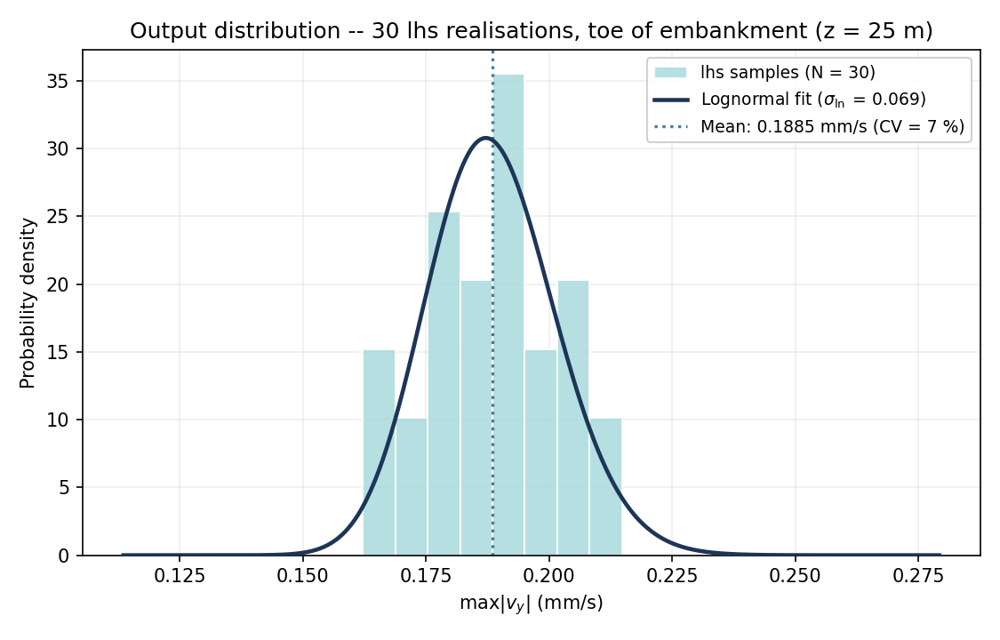
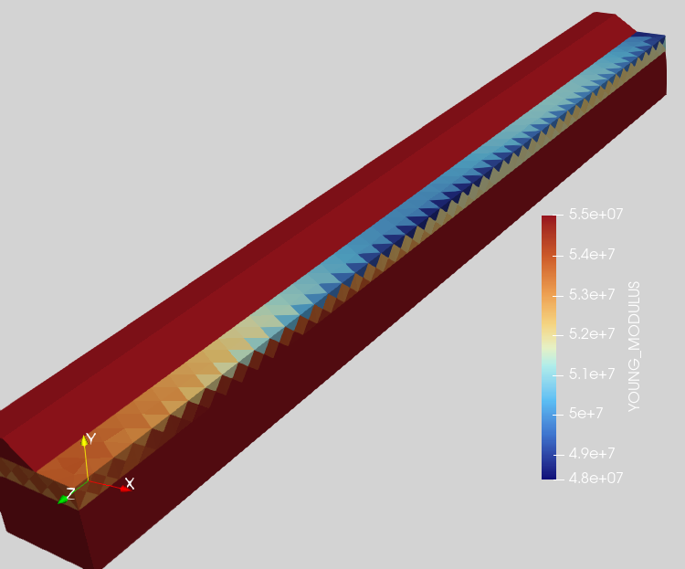
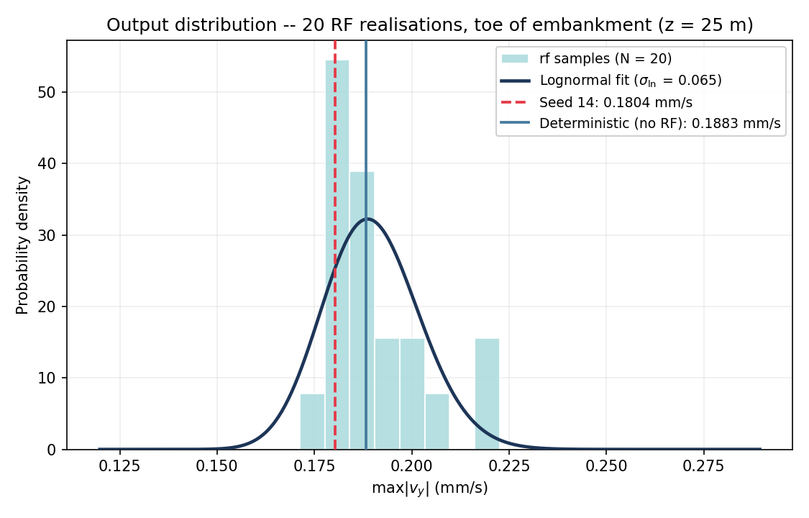
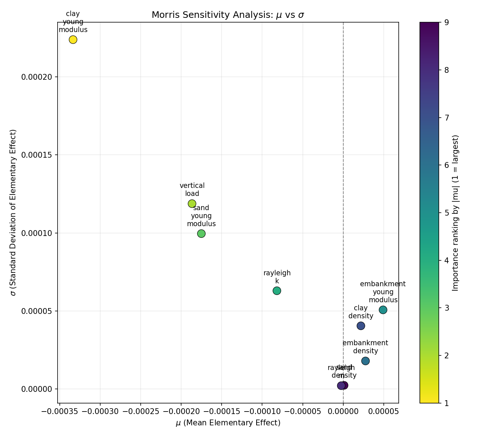

.. _tutorial_sensitivity:

STEMProb tutorial -- probabilistic and sensitivity analysis of a 3D embankment model
========================================================================================

Overview
--------
This tutorial shows how to run uncertainty analyses on a STEM
model of an embankment carrying a moving load: how much the vibration response
varies given uncertain soil, load and damping parameters, and which of those
parameters matter most.

The tutorial is organised as follows:

1. **Build the base model** -- a small, fast-running 3D moving-load model that
   will later be re-run many times, once per sample.
2. **Uncertainty quantification** -- Monte Carlo / Latin Hypercube sampling
   and Random Fields: propagate realistic parameter and spatial uncertainty
   through the model and look at the resulting output distribution.
3. **Sensitivity analysis** -- screen which of the uncertain parameters matter most for
   the response.

The code blocks below build on each other, in order, within each chapter --
paste them into a single script as you read to reproduce a chapter's
results yourself. To skip ahead instead, each chapter has a complete,
ready-to-run script: ``clean/tutorial_sensitivity_model.py`` (Build the base
model), ``clean/tutorial_sensitivity_base.py`` together with
``clean/tutorial_sensitivity_mc.py`` / ``clean/tutorial_sensitivity_rf.py``
(Uncertainty quantification), and ``clean/tutorial_sensitivity_morris.py``
(Sensitivity analysis). These take real, unattended run time (the Morris
script alone is ~100 STEM runs) -- that is expected, not a sign something is
wrong.

Build the base model
------------------

Imports and setup
------------------
First the necessary packages are imported and the input folder is defined.

.. code-block:: python

    input_files_dir = "tutorial_sensitivity_model"

    from stem.model import Model
    from stem.soil_material import OnePhaseSoil, LinearElasticSoil, SoilMaterial, SaturatedBelowPhreaticLevelLaw
    from stem.load import MovingLoad
    from stem.boundary import DisplacementConstraint
    from stem.output import NodalOutput, VtkOutputParameters, JsonOutputParameters
    from stem.solver import AnalysisType, SolutionType, TimeIntegration, DisplacementConvergenceCriteria, \
        NewtonRaphsonStrategy, NewmarkScheme, Amgcl, StressInitialisationType, SolverSettings, Problem
    from stem.stem import Stem

..    # END CODE BLOCK

Variables and their variation ranges
-------------------------------------
Nine parameters are varied across this tutorial: the density and Young's
modulus of each of the three soil layers, the vertical load magnitude, and the
two Rayleigh damping coefficients. Poisson's ratio (0.2) and porosity (0.3) are
kept fixed for all layers.

The table below lists, for each parameter, the reference ("mid-range") value
used to build the single deterministic model in this step, and the
``[min, max]`` range the Morris method will later sample from. These
ranges were chosen deliberately for this simplified model; how
realistic they are -- and what they should be for an actual design case --
is something to revisit once a more representative model is set up. The
Uncertainty quantification chapter uses its own, narrower uncertainty ranges
around the same reference values -- see that chapter.

.. list-table::
   :header-rows: 1
   :widths: 24 14 20 20 22

   * - Parameter
     - Unit
     - Reference value
     - Morris range
     - Applies to
   * - ``clay_density``
     - kg/m3
     - 2000
     - [1000, 3000]
     - ``soil_layer_2`` (clay, under embankment)
   * - ``clay_young_modulus``
     - Pa
     - 60e6
     - [20e6, 100e6]
     - ``soil_layer_2``
   * - ``sand_density``
     - kg/m3
     - 2000
     - [1000, 3000]
     - ``soil_layer_1`` (sand, bottom layer)
   * - ``sand_young_modulus``
     - Pa
     - 250e6
     - [100e6, 400e6]
     - ``soil_layer_1``
   * - ``embankment_density``
     - kg/m3
     - 2000
     - [1000, 3000]
     - ``embankment_layer``
   * - ``embankment_young_modulus``
     - Pa
     - 100e6
     - [50e6, 150e6]
     - ``embankment_layer``
   * - ``vertical_load``
     - N
     - -30000
     - [-40000, -20000]
     - moving load magnitude
   * - ``rayleigh_k``
     - -
     - 5e-4
     - [1e-6, 1e-3]
     - stiffness-proportional damping
   * - ``rayleigh_m``
     - -
     - 0.5
     - [0.1, 0.9]
     - mass-proportional damping

.. code-block:: python

    reference_parameters = {
        "clay_density": 2000.0,
        "clay_young_modulus": 60e6,
        "sand_density": 2000.0,
        "sand_young_modulus": 250e6,
        "embankment_density": 2000.0,
        "embankment_young_modulus": 100e6,
        "vertical_load": -30000.0,
        "rayleigh_k": 5e-4,
        "rayleigh_m": 0.5,
    }

..    # END CODE BLOCK

Geometry and materials
------------------------
The geometry consists of two soil layers and an embankment on top, defined by
coordinates in the x-y plane and extruded 50 m in the z-direction. The sand
layer is the bottom layer (3 m thick), the clay layer sits directly under the
embankment (1 m thick), and the embankment itself is a sloped fill on top,
with its crest at ``x=0.75`` (where the track/load sits) and its far toe at
``x=3.0``.

.. code-block:: python

    ndim = 3
    model = Model(ndim)

..    # END CODE BLOCK

.. code-block:: python

    p = reference_parameters

    sand_formulation = OnePhaseSoil(ndim, IS_DRAINED=True, DENSITY_SOLID=p["sand_density"], POROSITY=0.3)
    sand_law = LinearElasticSoil(YOUNG_MODULUS=p["sand_young_modulus"], POISSON_RATIO=0.2)
    sand_material = SoilMaterial("sand", sand_formulation, sand_law, SaturatedBelowPhreaticLevelLaw())

    clay_formulation = OnePhaseSoil(ndim, IS_DRAINED=True, DENSITY_SOLID=p["clay_density"], POROSITY=0.3)
    clay_law = LinearElasticSoil(YOUNG_MODULUS=p["clay_young_modulus"], POISSON_RATIO=0.2)
    clay_material = SoilMaterial("clay", clay_formulation, clay_law, SaturatedBelowPhreaticLevelLaw())

    embankment_formulation = OnePhaseSoil(ndim, IS_DRAINED=True, DENSITY_SOLID=p["embankment_density"], POROSITY=0.3)
    embankment_law = LinearElasticSoil(YOUNG_MODULUS=p["embankment_young_modulus"], POISSON_RATIO=0.2)
    embankment_material = SoilMaterial("embankment", embankment_formulation, embankment_law,
                                       SaturatedBelowPhreaticLevelLaw())

..    # END CODE BLOCK

.. code-block:: python

    soil1_coordinates = [(0.0, -2.0, 0.0), (5.0, -2.0, 0.0), (5.0, 1.0, 0.0), (0.0, 1.0, 0.0)]        # sand
    soil2_coordinates = [(0.0, 1.0, 0.0), (5.0, 1.0, 0.0), (5.0, 2.0, 0.0), (0.0, 2.0, 0.0)]           # clay
    embankment_coordinates = [(0.0, 2.0, 0.0), (3.0, 2.0, 0.0), (1.5, 3.0, 0.0), (0.75, 3.0, 0.0), (0.0, 3.0, 0.0)]

    model.extrusion_length = 50.0
    model.add_soil_layer_by_coordinates(soil1_coordinates, sand_material, "soil_layer_1")
    model.add_soil_layer_by_coordinates(soil2_coordinates, clay_material, "soil_layer_2")
    model.add_soil_layer_by_coordinates(embankment_coordinates, embankment_material, "embankment_layer")

..    # END CODE BLOCK

Load
----
A single moving point load on the embankment crest stands in for the train
(no rail, sleepers or UVEC), travelling at 30 m/s from ``[0.75, 3.0, 0.0]``.

.. code-block:: python

    load_coordinates = [(0.75, 3.0, 0.0), (0.75, 3.0, 50.0)]
    moving_load = MovingLoad(load=[0.0, p["vertical_load"], 0.0], direction_signs=[1, 1, 1],
                             velocity=30, origin=[0.75, 3.0, 0.0], offset=0.0)
    model.add_load_by_coordinates(load_coordinates, moving_load, "moving_load")

..    # END CODE BLOCK

Why this model is deliberately small
.....................................
Uncertainty analyses need many independent model evaluations
rather than a single run. To keep that affordable, the model used throughout
this tutorial is intentionally reduced in every dimension that drives run
time:

* a narrow, 5 m wide soil cross-section, extruded only 50 m along the track,
* a coarse 1 m mesh (``element_size=1.0``),
* a short analysis duration of 2 s with a relatively large 0.1 s time step,
* a single moving point load standing in for the train (no rail, sleepers or
  UVEC vehicle model),
* no absorbing boundaries on the sides of the domain.

All these makes the model not a true representative of a real vibration assessment --
the domain is too short and narrow, the mesh too coarse, and the time step
too large to capture the frequency content a real assessment would need. The
model is only meant to be *fast enough to run many times in short time for the sake of fast reproducibility of the results* so that the
methods themselves can be demonstrated.

Output points
-------------
STEM records the response at whichever coordinates are given here. As an
example, this tutorial uses a single point at the toe of the embankment,
roughly midway along the track (``x=3.0``, ``y=2.0``, ``z=25``); every step
below tracks the vertical velocity (:math:`v_y`) at this point. This is just
an example choice for now -- for an actual design, the output point(s)
should be chosen based on where the response actually matters (e.g. a
building or receiver location), and may well be different.

.. code-block:: python

    output_coordinates = [
        (3.0, 2.0, 25.0),   # toe of embankment, example point
    ]
    nodal_results = [NodalOutput.DISPLACEMENT, NodalOutput.VELOCITY]

    model.add_output_settings_by_coordinates(
        coordinates=output_coordinates,
        part_name="sensitivity_output",
        output_parameters=JsonOutputParameters(
            output_interval=0.05,
            nodal_results=nodal_results,
            gauss_point_results=[],
        ),
        output_dir="output",
        output_name="sensitivity_output",
    )

..    # END CODE BLOCK

Adding output settings by coordinates alters the geometry, so it must be
synchronised again afterwards. This is also a convenient point to inspect the
generated surface ids, which are needed for the boundary conditions below.

.. code-block:: python

    model.synchronise_geometry()
    model.show_geometry(show_surface_ids=True)

..    # END CODE BLOCK

.. image:: _static/tutorial_sensitivity_geometry.png
    :align: center
    :alt: Model geometry from model.show_geometry(show_surface_ids=True) -- sand, clay and embankment layers, extruded 50 m, with surface ids labelled.

Boundary conditions, mesh and solver settings
------------------------------------------------
The rest of the setup is standard STEM configuration: a fixed base with roller
sides (no absorbing boundaries -- see the note above on why this model isn't
representative of a real assessment), a coarse 1 m mesh, and a short 2 s
dynamic analysis with a 0.1 s time step, using the reference Rayleigh damping
values.

.. code-block:: python

    # Boundary conditions: fixed base, roller sides (x/z fixed, y free)
    no_displacement_parameters = DisplacementConstraint(is_fixed=[True, True, True], value=[0, 0, 0])
    roller_displacement_parameters = DisplacementConstraint(is_fixed=[True, False, True], value=[0, 0, 0])
    model.add_boundary_condition_by_geometry_ids(2, [1], no_displacement_parameters, "base_fixed")
    model.add_boundary_condition_by_geometry_ids(2, [2, 4, 5, 6, 7, 10, 11, 12, 15, 16, 17],
                                                 roller_displacement_parameters, "sides_roller")

    # Mesh: coarse, uniform element size
    model.set_mesh_size(element_size=1.0)

    # Solver settings: short dynamic analysis, constant matrices, reference Rayleigh damping
    analysis_type = AnalysisType.MECHANICAL
    solution_type = SolutionType.DYNAMIC
    time_integration = TimeIntegration(start_time=0.0, end_time=2.0, delta_time=0.1,
                                       reduction_factor=1.0, increase_factor=1.0)
    convergence_criterion = DisplacementConvergenceCriteria(displacement_relative_tolerance=1.0e-4,
                                                            displacement_absolute_tolerance=1.0e-9)
    strategy_type = NewtonRaphsonStrategy()
    scheme_type = NewmarkScheme()
    linear_solver_settings = Amgcl()
    stress_initialisation_type = StressInitialisationType.NONE

    solver_settings = SolverSettings(analysis_type=analysis_type, solution_type=solution_type,
                                     stress_initialisation_type=stress_initialisation_type,
                                     time_integration=time_integration,
                                     is_stiffness_matrix_constant=True, are_mass_and_damping_constant=True,
                                     convergence_criteria=convergence_criterion,
                                     strategy_type=strategy_type, scheme=scheme_type,
                                     linear_solver_settings=linear_solver_settings,
                                     rayleigh_k=p["rayleigh_k"], rayleigh_m=p["rayleigh_m"])

    # Problem definition and VTK output (for visual inspection in Paraview)
    problem = Problem(problem_name="tutorial_sensitivity_base_model", number_of_threads=1,
                      settings=solver_settings)
    model.project_parameters = problem

    model.add_output_settings(
        part_name="porous_computational_model_part",
        output_name="vtk_output",
        output_dir="output",
        output_parameters=VtkOutputParameters(
            output_interval=1,
            nodal_results=nodal_results,
            gauss_point_results=[],
            output_control_type="step"
        )
    )

..    # END CODE BLOCK

Running the base model
------------------------
The model is now complete. The calculation is run once, using the reference
parameter values, to confirm the model is set up correctly before moving on
to the probabilistic analyses.

.. code-block:: python

    stem = Stem(model, input_files_dir)
    stem.write_all_input_files()
    stem.run_calculation()

..    # END CODE BLOCK

Wrapping the model as a function
-----------------------------------
Every step from here on -- Monte Carlo, Random Field, and sensitivity analysis -- repeats
this model many times with different parameter values. It is convenient to
wrap the model into two plain functions: one that builds it from a set of
parameter values, and one that runs it and reduces the result down to a
single number.

``build_model`` below is the same construction as above -- materials,
geometry, load, output point, boundary conditions, mesh, solver settings --
with all nine table parameters turned into arguments instead of fixed
reference values, plus two optional arguments (``rf_seed``, and its settings
``rf_cov``/``rf_anisotropy``) used later by the Random Field chapter: when
``rf_seed`` is given, a spatial random field is applied to the clay layer's
Young's modulus on top of the ``clay_young_modulus`` value, using the same
``RandomFieldGenerator`` mechanism as tutorial 4. ``run_model`` builds the
model, runs it, and reads back the ``VELOCITY_Y`` time series at the output
point, reducing it to its peak absolute value, ``max(|v_y|)``. That
particular reduction is just an example: depending on what the study is
meant to answer, a different output point, a different recorded quantity, or
a different way of summarising the time series could be used instead.

The two random-field helper functions below (``create_random_field_generator``,
``create_parameter_field_parameters``) live in ``clean/random_field_utils.py``
and ``clean/parameter_field_utils.py`` -- small wrappers that make the
``RandomFieldGenerator``/``ParameterFieldParameters`` construction robust
across STEM versions. Keep those two files alongside your script (they ship
in ``clean/`` next to this tutorial).

.. code-block:: python

    import os
    import json
    import numpy as np
    from random_field_utils import create_random_field_generator
    from parameter_field_utils import create_parameter_field_parameters

    OUTPUT_POINT = (3.0, 2.0, 25.0)  # same point as above

    def build_model(clay_density, clay_young_modulus, sand_density, sand_young_modulus,
                     embankment_density, embankment_young_modulus, vertical_load,
                     rayleigh_k, rayleigh_m,
                     rf_seed=None, rf_cov=0.1, rf_anisotropy=10.0) -> Model:
        ndim = 3
        model = Model(ndim)

        sand_formulation = OnePhaseSoil(ndim, IS_DRAINED=True, DENSITY_SOLID=sand_density, POROSITY=0.3)
        sand_law = LinearElasticSoil(YOUNG_MODULUS=sand_young_modulus, POISSON_RATIO=0.2)
        sand_material = SoilMaterial("sand", sand_formulation, sand_law, SaturatedBelowPhreaticLevelLaw())

        clay_formulation = OnePhaseSoil(ndim, IS_DRAINED=True, DENSITY_SOLID=clay_density, POROSITY=0.3)
        clay_law = LinearElasticSoil(YOUNG_MODULUS=clay_young_modulus, POISSON_RATIO=0.2)
        clay_material = SoilMaterial("clay", clay_formulation, clay_law, SaturatedBelowPhreaticLevelLaw())

        embankment_formulation = OnePhaseSoil(ndim, IS_DRAINED=True, DENSITY_SOLID=embankment_density, POROSITY=0.3)
        embankment_law = LinearElasticSoil(YOUNG_MODULUS=embankment_young_modulus, POISSON_RATIO=0.2)
        embankment_material = SoilMaterial("embankment", embankment_formulation, embankment_law,
                                           SaturatedBelowPhreaticLevelLaw())

        soil1_coordinates = [(0.0, -2.0, 0.0), (5.0, -2.0, 0.0), (5.0, 1.0, 0.0), (0.0, 1.0, 0.0)]
        soil2_coordinates = [(0.0, 1.0, 0.0), (5.0, 1.0, 0.0), (5.0, 2.0, 0.0), (0.0, 2.0, 0.0)]
        embankment_coordinates = [(0.0, 2.0, 0.0), (3.0, 2.0, 0.0), (1.5, 3.0, 0.0), (0.75, 3.0, 0.0), (0.0, 3.0, 0.0)]

        model.extrusion_length = 50.0
        model.add_soil_layer_by_coordinates(soil1_coordinates, sand_material, "soil_layer_1")
        model.add_soil_layer_by_coordinates(soil2_coordinates, clay_material, "soil_layer_2")
        model.add_soil_layer_by_coordinates(embankment_coordinates, embankment_material, "embankment_layer")

        if rf_seed is not None:
            random_field_generator = create_random_field_generator(
                dim=3, cov=rf_cov, model_name="Gaussian", v_scale_fluctuation=1,
                anisotropy=[rf_anisotropy], angle=[0], seed=rf_seed,
            )
            field_parameters = create_parameter_field_parameters(
                property_name="YOUNG_MODULUS", function_type="json_file",
                field_generator=random_field_generator,
            )
            model.add_field(part_name="soil_layer_2", field_parameters=field_parameters)

        load_coordinates = [(0.75, 3.0, 0.0), (0.75, 3.0, 50.0)]
        moving_load = MovingLoad(load=[0.0, vertical_load, 0.0], direction_signs=[1, 1, 1],
                                 velocity=30, origin=[0.75, 3.0, 0.0], offset=0.0)
        model.add_load_by_coordinates(load_coordinates, moving_load, "moving_load")

        model.add_output_settings_by_coordinates(
            coordinates=[OUTPUT_POINT],
            part_name="sensitivity_output",
            output_parameters=JsonOutputParameters(
                output_interval=0.05,
                nodal_results=[NodalOutput.VELOCITY],
                gauss_point_results=[],
            ),
            output_dir="output",
            output_name="sensitivity_output",
        )
        model.synchronise_geometry()

        no_displacement_parameters = DisplacementConstraint(is_fixed=[True, True, True], value=[0, 0, 0])
        roller_displacement_parameters = DisplacementConstraint(is_fixed=[True, False, True], value=[0, 0, 0])
        model.add_boundary_condition_by_geometry_ids(2, [1], no_displacement_parameters, "base_fixed")
        model.add_boundary_condition_by_geometry_ids(2, [2, 4, 5, 6, 7, 10, 11, 12, 15, 16, 17],
                                                     roller_displacement_parameters, "sides_roller")

        model.set_mesh_size(element_size=1.0)

        time_integration = TimeIntegration(start_time=0.0, end_time=2.0, delta_time=0.1,
                                           reduction_factor=1.0, increase_factor=1.0)
        convergence_criterion = DisplacementConvergenceCriteria(displacement_relative_tolerance=1.0e-4,
                                                                displacement_absolute_tolerance=1.0e-9)
        solver_settings = SolverSettings(analysis_type=AnalysisType.MECHANICAL, solution_type=SolutionType.DYNAMIC,
                                         stress_initialisation_type=StressInitialisationType.NONE,
                                         time_integration=time_integration,
                                         is_stiffness_matrix_constant=True, are_mass_and_damping_constant=True,
                                         convergence_criteria=convergence_criterion,
                                         strategy_type=NewtonRaphsonStrategy(), scheme=NewmarkScheme(),
                                         linear_solver_settings=Amgcl(),
                                         rayleigh_k=rayleigh_k, rayleigh_m=rayleigh_m)

        model.project_parameters = Problem(problem_name="tutorial_sensitivity_probabilistic", number_of_threads=1,
                                           settings=solver_settings)
        return model

    def run_model(parameters, rf_seed=None, rf_cov=0.1, rf_anisotropy=10.0) -> dict:
        model = build_model(*parameters, rf_seed=rf_seed, rf_cov=rf_cov, rf_anisotropy=rf_anisotropy)
        stem = Stem(model, input_files_dir)
        stem.write_all_input_files()
        stem.run_calculation()

        with open(os.path.join(input_files_dir, "output", "sensitivity_output.json")) as f:
            results = json.load(f)

        node_key = next(k for k in results if k.startswith("NODE_"))
        v_y = np.asarray(results[node_key]["VELOCITY_Y"], dtype=float)
        return {"time": results["TIME"], "v_y": v_y, "v_y_max": float(np.max(np.abs(v_y)))}

..    # END CODE BLOCK

This ``build_model`` / ``run_model`` pair (also saved for reference in
``clean/tutorial_sensitivity_base.py``) is what every remaining code block in
this tutorial calls -- no further redefinition needed from here on.

Uncertainty quantification
------------------------------
A natural starting point for studying uncertainty in the model is to ask:
given what is actually believed about the uncertainty in these parameters,
what does the response look like -- its full distribution, not just a single
number? Monte Carlo (MC) can answer that directly: draw many parameter
sets from their uncertainty distributions, run the model for each, and look
at the resulting spread of outputs. This is useful whenever the goal is to
see the *distribution* of results over the uncertain parameters -- e.g. to
estimate a probability of exceeding some vibration limit. This can be done 
with either crude Monte Carlo or Latin Hypercube sampling, as described below.

This chapter reuses ``build_model`` and ``run_model`` unchanged.

Monte Carlo and Latin Hypercube sampling
............................................
Sampling needs *realistic* uncertainty. Material properties are given a
lognormal distribution (always positive); load and damping are given a
normal distribution. Both use a 5% coefficient of variation (COV) around the
reference values -- an example choice, it is not valictaed through any geotechnical survey.

.. list-table::
   :header-rows: 1
   :widths: 30 20 15 20

   * - Parameter
     - Distribution
     - Mean
     - COV
   * - clay/sand/embankment density, Young's modulus
     - lognormal
     - reference value
     - 5%
   * - ``vertical_load``, ``rayleigh_k``, ``rayleigh_m``
     - normal
     - reference value
     - 5%

As code, the same nine distributions, plus a helper that maps a Uniform[0,1]
draw to a physical parameter value through that parameter's inverse CDF --
this is what makes crude Monte Carlo and LHS interchangeable further down:
both produce a Uniform[0,1] array, just with different coverage of the
9-dimensional space, and this same function converts either to physical
units.

.. code-block:: python

    from scipy import stats

    DISTRIBUTIONS = {
        "clay_density":             {"mean": 2000.0, "cov": 0.05, "dist": "lognormal"},
        "clay_young_modulus":       {"mean": 60e6,   "cov": 0.05, "dist": "lognormal"},
        "sand_density":              {"mean": 2000.0, "cov": 0.05, "dist": "lognormal"},
        "sand_young_modulus":       {"mean": 250e6,  "cov": 0.05, "dist": "lognormal"},
        "embankment_density":       {"mean": 2000.0, "cov": 0.05, "dist": "lognormal"},
        "embankment_young_modulus": {"mean": 100e6,  "cov": 0.05, "dist": "lognormal"},
        "vertical_load":             {"mean": -30000.0, "cov": 0.05, "dist": "normal"},
        "rayleigh_k":                {"mean": 5e-4,     "cov": 0.05, "dist": "normal"},
        "rayleigh_m":                {"mean": 0.5,      "cov": 0.05, "dist": "normal"},
    }
    NAMES = list(DISTRIBUTIONS.keys())

    def uniform_to_parameters(u: np.ndarray) -> np.ndarray:
        out = np.empty_like(u)
        for i, name in enumerate(NAMES):
            d = DISTRIBUTIONS[name]
            if d["dist"] == "lognormal":
                sigma_ln = np.sqrt(np.log(1 + d["cov"] ** 2))
                mu_ln = np.log(d["mean"]) - 0.5 * sigma_ln ** 2
                out[:, i] = stats.lognorm.ppf(u[:, i], s=sigma_ln, scale=np.exp(mu_ln))
            else:  # normal
                std = abs(d["mean"]) * d["cov"]
                out[:, i] = stats.norm.ppf(u[:, i], loc=d["mean"], scale=std)
        return out

..    # END CODE BLOCK

Turning ``N`` draws from Uniform[0,1] per parameter into a sample set can be
done in more than one way:

* **Crude Monte Carlo** -- each parameter is drawn independently, ``N``
  times. Simple, but for a modest ``N`` the samples can clump together and
  leave gaps in the parameter space.
* **Latin Hypercube Sampling (LHS)** -- each parameter's range is split into
  ``N`` equal-probability bins, and exactly one sample is drawn per bin. This
  spreads the ``N`` samples more evenly across the space, so for the same
  sample budget LHS usually gives a more stable estimate of the output
  distribution than crude Monte Carlo.

Either can be used here -- both just produce an ``(N, 9)`` array of Uniform[0,1]
draws, which is then mapped to physical parameter values through each
parameter's inverse CDF (see ``uniform_to_parameters`` in the script below).
This tutorial uses LHS.

.. code-block:: python

    from scipy.stats import qmc

    N = 30
    sampler = qmc.LatinHypercube(d=9, seed=42)
    u = sampler.random(n=N)                 # (30, 9) array in [0, 1]
    samples = uniform_to_parameters(u)      # -> physical parameter values

    v_y_max = np.empty(N)
    for i, sample in enumerate(samples):
        v_y_max[i] = run_model(sample)["v_y_max"]

..    # END CODE BLOCK

The histogram below is drawn from ``v_y_max`` with a fitted lognormal curve,
in the same style used throughout this tutorial:

.. code-block:: python

    import matplotlib.pyplot as plt

    v = v_y_max * 1000  # mm/s
    mu_v, sd_v = v.mean(), v.std(ddof=1)
    ln_shape, ln_loc, ln_scale = stats.lognorm.fit(v, floc=0)
    x_fit = np.linspace(v.min() * 0.7, v.max() * 1.3, 400)

    os.makedirs("sensitivity_plots", exist_ok=True)
    fig, ax = plt.subplots(figsize=(7.5, 4.8))
    ax.hist(v, bins=max(8, N // 4), density=True, color="#a8dadc", edgecolor="white",
            alpha=0.85, label=f"lhs samples (N = {N})")
    ax.plot(x_fit, stats.lognorm.pdf(x_fit, ln_shape, ln_loc, ln_scale), color="#1d3557",
            lw=2.2, label=fr"Lognormal fit ($\sigma_\ln$ = {ln_shape:.3f})")
    ax.axvline(mu_v, color="#457b9d", ls=":", lw=1.6,
               label=fr"Mean: {mu_v:.4f} mm/s (CV = {sd_v / mu_v * 100:.0f} %)")
    ax.set_xlabel(r"max$|v_y|$ (mm/s)")
    ax.set_ylabel("Probability density")
    ax.legend(fontsize=9, loc="upper right", framealpha=0.9)
    fig.savefig("sensitivity_plots/tutorial_sensitivity_mc_histogram_lhs.png", dpi=150)

..    # END CODE BLOCK

The figure below is the actual output of this code (``N=30``, the
distributions and settings documented above).

Across the 30 samples, ``max|v_y|`` at the toe-of-embankment point ranges from
0.162 to 0.215 mm/s, with a mean of 0.189 mm/s and a coefficient of variation
of about 7% -- i.e. propagating a 5% COV on each of the nine input parameters
through the model gives roughly 7% COV on the response, at this point, for
this reduced model with this limited number of samples.

Random Field
............................................
So far every parameter has been a single value per soil layer -- uniform
across the whole domain (deterministic model). In reality soil properties vary spatially. STEM can
generate a spatially correlated random field for a chosen material property
directly, the same mechanism used in the tutorial_cpt_random_fields/docs/index.rst. Here we
applied RF only to the clay layer's Young's modulus (``soil_layer_2``), keeping
the other eight parameters fixed at their Step 1 reference values.

.. list-table::
   :header-rows: 1
   :widths: 30 70

   * - Setting
     - Used here
   * - Property
     - ``clay_young_modulus`` (``soil_layer_2``)
   * - Field model
     - Gaussian
   * - Coefficient of variation
     - 0.1
   * - Horizontal correlation length (anisotropy)
     - 10 m
   * - Seed
     - 14 (single example run below); a range of seeds for the distribution

.. code-block:: python

    result = run_model(list(reference_parameters.values()), rf_seed=14, rf_cov=0.1, rf_anisotropy=10.0)

..    # END CODE BLOCK

The colour scale above is illustrative of the spatial uncertainty -- it shows what a
Gaussian random field on a soil layer's Young's modulus actually looks like:
smoothly varying in space rather than a single uniform value.

A single run only gives one realisation of the field. As with Monte Carlo,
repeating the run over a set of seeds (all other parameters unchanged) builds
up a distribution of the response. Two reference values are added alongside
that distribution: the seed-14 run already computed above, and a
deterministic run with the same reference parameters and no random field at
all (the same calculation as "Running the base model" earlier).

.. code-block:: python

    reference_parameters_list = list(reference_parameters.values())

    seeds = list(range(1, 21))
    rf_v_y_max = np.empty(len(seeds))
    for i, seed in enumerate(seeds):
        rf_v_y_max[i] = run_model(reference_parameters_list, rf_seed=seed, rf_cov=0.1, rf_anisotropy=10.0)["v_y_max"]

    seed14_value = float(rf_v_y_max[seeds.index(14)])
    deterministic_value = run_model(reference_parameters_list)["v_y_max"]  # rf_seed=None -> no RF

    v = rf_v_y_max * 1000  # mm/s
    ln_shape, ln_loc, ln_scale = stats.lognorm.fit(v, floc=0)
    x_fit = np.linspace(v.min() * 0.7, v.max() * 1.3, 400)

    os.makedirs("sensitivity_plots", exist_ok=True)
    fig, ax = plt.subplots(figsize=(7.5, 4.8))
    ax.hist(v, bins=max(8, len(seeds) // 4), density=True, color="#a8dadc", edgecolor="white",
            alpha=0.85, label=f"rf samples (N = {len(seeds)})")
    ax.plot(x_fit, stats.lognorm.pdf(x_fit, ln_shape, ln_loc, ln_scale), color="#1d3557",
            lw=2.2, label=fr"Lognormal fit ($\sigma_\ln$ = {ln_shape:.3f})")
    ax.axvline(seed14_value * 1000, color="#e63946", ls="--", lw=1.8,
               label=f"Seed 14: {seed14_value * 1000:.4f} mm/s")
    ax.axvline(deterministic_value * 1000, color="#457b9d", ls="-", lw=1.8,
               label=f"Deterministic (no RF): {deterministic_value * 1000:.4f} mm/s")
    ax.set_xlabel(r"max$|v_y|$ (mm/s)")
    ax.set_ylabel("Probability density")
    ax.legend(fontsize=9, loc="upper right", framealpha=0.9)
    fig.savefig("sensitivity_plots/tutorial_sensitivity_rf_histogram.png", dpi=150)

..    # END CODE BLOCK

The figure below is the actual output of this code (20 random field
realisations, seeds 1-20, settings as documented above).

The red dashed line marks the single-example run above (seed 14:
0.1804 mm/s); the blue solid line marks the deterministic run with the same
reference parameters and no random field at all (0.1883 mm/s) -- i.e. the
same calculation as "Running the base model" in the first chapter of this tutorial. Across the 20
realisations, ``max|v_y|`` ranges from 0.171 to 0.223 mm/s, mean 0.190 mm/s,
CoV about 7% -- close to the Monte Carlo spread above, even though only *one*
property (i.e., clay Young's modulus) is varied here, spatially, instead of all
nine parameters varied as single values. This is not a general result -- it
is a property of this particular model, output point and choice of RF
settings -- but it illustrates the point of doing a Random Field study at
all: spatial variability alone, at a realistic COV and correlation length,
can be a significant source of response variability in its own right,
separate from the parameter-to-parameter uncertainty covered above.

Applying sensitivity analysis
-------------------------------------
Here we introduce two sensitivity analysis methods (i.e., Morris and FAST-RBD), 
for details of the theory, see Saltelli, A., Ratto, M., Andres, T., Campolongo, 
F., Cariboni, J., Gatelli, D., Saisana, M., and Tarantola, S. (2008), 
*Global Sensitivity Analysis: The Primer*, John Wiley & Sons.

Morris is a *screening* method: it runs the model many times, each time
nudging one parameter at a time along a random path through the parameter
space, and uses the resulting changes in the output (the "elementary
effects") to rank which parameters matter most -- without needing anywhere
near as many runs as a full variance-based method (e.g. the Sobol’ method) would.

This step reuses ``build_model`` and ``run_model`` from Step 1, together with
a ``problem`` definition holding the nine parameter names and Morris ranges
from the table earlier.

Morris settings
---------------------------
Generating the trajectories and computing the sensitivity indices from them
is controlled by a handful of settings.

.. list-table::
   :header-rows: 1
   :widths: 20 55 25

   * - Setting
     - What it controls
     - Used here
   * - ``N``
     - Number of trajectories, :math:`r`. Total STEM runs = :math:`N \times (\text{num\_vars} + 1)`.
       More trajectories -> smoother, more reliable indices, at the cost of
       proportionally more runs.
     - 10 (100 runs total)
   * - ``num_levels``
     - Number of levels, :math:`p`, in the grid each parameter is discretised
       into. Each elementary-effect step covers :math:`p / (2(p-1))` of the
       parameter's full range. Must be even for the standard Morris design.
     - 4
   * - ``scaled``
     - Whether the output values are standardised before computing the
       indices. Left ``False`` here so ``mu``/``mu_star``/``sigma`` stay in
       the physical units of ``max(|v_y|)``.
     - ``False``
   * - ``seed`` (sampling)
     - RNG seed for the trajectory design, for reproducibility.
     - 42
   * - ``seed`` (analysis)
     - Seed used internally when computing the indices; independent of the
       sampling seed.
     - 42

.. code-block:: python

    from SALib.sample import morris as morris_sample
    from SALib.analyze import morris as morris_analyze

    problem = {
        "num_vars": 9,
        "names": ["clay_density", "clay_young_modulus", "sand_density", "sand_young_modulus",
                  "embankment_density", "embankment_young_modulus", "vertical_load",
                  "rayleigh_k", "rayleigh_m"],
        "bounds": [[1000, 3000], [20e6, 100e6], [1000, 3000], [100e6, 400e6],
                  [1000, 3000], [50e6, 150e6], [-40000, -20000], [1e-6, 1e-3], [0.1, 0.9]],
    }

    N = 10
    num_levels = 4
    samples = morris_sample.sample(problem, N=N, num_levels=num_levels, seed=42)
    # len(samples) == N * (problem["num_vars"] + 1) == 100

..    # END CODE BLOCK

Another method: RBD-FAST
----------------------------
RBD-FAST (Random Balanced Design - Fourier Amplitude Sensitivity Test) is a 
variance-based sensitivity method. It estimates each parameter's first-order 
Sobol' index ``S1`` -- the fraction of output variance explained by that 
parameter alone -- directly from an ordinary random or LHS sample, such as 
the one already drawn for the Monte Carlo study in the Uncertainty 
quantification chapter. No results are run for it in this tutorial, 
but it is worth knowing it is available.

.. list-table::
   :header-rows: 1
   :widths: 24 38 38

   * -
     - Morris
     - RBD-FAST
   * - Output
     - Elementary-effects ranking (``mu``, ``mu_star``, ``sigma``)
     - First-order Sobol' index ``S1`` per parameter (normalised, 0-1)
   * - Sampling
     - Its own trajectory design
     - Any random/LHS sample -- can reuse the Monte Carlo samples above
   * - Interactions
     - Flagged qualitatively via ``sigma``
     - Not captured (``S1`` is first-order only)
   * - Best for
     - Cheap screening of many parameters
     - A normalised importance measure from samples already on hand

Sensitivity analysis workflow
---------------------
Each row of ``samples`` is one full STEM run; once every output has been
collected, the indices are computed in a single call.

.. code-block:: python

    outputs = np.empty(len(samples))
    for i, sample in enumerate(samples):
        outputs[i] = run_model(sample)["v_y_max"]

    Si = morris_analyze.analyze(problem, samples, outputs, num_levels=num_levels,
                                scaled=False, seed=42, print_to_console=True)

..    # END CODE BLOCK

Interpreting the Morris results
----------------------------------
``Si`` holds three arrays, one value per parameter:

* ``mu`` -- the *signed* mean elementary effect. A **positive** value means
  increasing that parameter tends to *increase* ``max(|v_y|)`` on average
  across the sampled trajectories; a **negative** value means increasing it
  tends to *decrease* the response.
* ``mu_star`` -- the mean of the *absolute* elementary effects. Unlike ``mu``,
  opposite-signed effects from different trajectories don't cancel out, which
  makes ``mu_star`` the more reliable overall importance ranking, especially
  for non-monotonic responses.
* ``sigma`` -- the standard deviation of the elementary effects. A large
  ``sigma`` relative to ``mu_star`` means the parameter's effect is not
  constant across the parameter space -- it is either nonlinear on its own or
  interacts with other parameters.

The :math:`\mu` vs :math:`\sigma` scatter is a standard way to see this at a
glance: points far from the dashed zero line have a strong average effect;
points high up on the :math:`\sigma` axis have an effect that varies a lot
across the sampled trajectories (nonlinear and/or interacting with other
parameters); points near the origin, on both axes, can be treated as
comparatively unimportant over the ranges screened here.

.. code-block:: python

    import matplotlib.pyplot as plt

    mu, sigma = np.asarray(Si["mu"]), np.asarray(Si["sigma"])
    rank_by_abs_mu = np.argsort(np.argsort(-np.abs(mu))) + 1  # 1 = largest |mu|

    fig, ax = plt.subplots(figsize=(9, 8))
    sc = ax.scatter(mu, sigma, c=rank_by_abs_mu, cmap="viridis_r", s=110, edgecolors="k")
    ax.axvline(0, color="grey", linestyle="--")
    for name, x, y in zip(problem["names"], mu, sigma):
        ax.annotate(name, (x, y), textcoords="offset points", xytext=(0, 10), ha="center")
    ax.set_xlabel(r"$\mu$ (Mean Elementary Effect)")
    ax.set_ylabel(r"$\sigma$ (Standard Deviation of Elementary Effect)")
    fig.colorbar(sc, ax=ax, label="Importance ranking by |mu| (1 = largest)")
    fig.savefig("sensitivity_plots/tutorial_sensitivity_morris_mu_sigma.png", dpi=150)

..    # END CODE BLOCK

Results
----------
The figure below is the actual output of ``clean/tutorial_sensitivity_morris.py``
run with the settings documented above (``N=10``, ``num_levels=4``, 100 STEM
runs), screening all nine parameters against ``max(|v_y|)`` at the
toe-of-embankment / track-midpoint point.

Colour encodes the importance ranking by :math:`|\mu|` alone (1 = largest,
shown yellow; 9 = smallest, shown dark purple) -- a quick ranking cue on top
of the two axes, without accounting for the nonlinearity/interaction that
:math:`\sigma` captures separately.

By that ranking, ``clay_young_modulus``, ``vertical_load``,
``sand_young_modulus`` and ``rayleigh_k`` are the four largest drivers of
``max|v_y|`` at this point, and all four also sit highest on the
:math:`\sigma` axis -- their effect is not just large on average, it also
varies substantially across the sampled trajectories. All four have a
**negative** :math:`\mu`: increasing clay or sand stiffness, or increasing
the stiffness-proportional damping ``rayleigh_k``, tends to *decrease* the
response, and increasing ``vertical_load`` (i.e. making the downward load
less negative, so physically *smaller*) also decreases it -- equivalently, a
*larger* load magnitude increases the response, which matches physical
expectation. The remaining five parameters (``embankment_young_modulus``,
``embankment_density``, ``clay_density``, ``rayleigh_m``, ``sand_density``)
have small, positive :math:`\mu` and sit close to the origin on both axes --
comparatively unimportant over the ranges screened here.

With only ``N=10`` trajectories, this is still a modest screening run --
combined with the reduced model size discussed above, treat the ranking as
illustrative of the workflow rather than a converged, design-ready result.
A more reliable screening would increase ``N`` further (e.g. 20-50) on top
of using a more representative model.

Extending to multiple locations
-----------------------------------
Everything above screens parameter importance at one output point. The same
Morris design can be evaluated at many points at once, at essentially no
extra STEM cost: a single run can already report the response at any number
of coordinates, so adding more output points to each of the samples above
does not mean more runs -- only ``morris_analyze.analyze`` needs to be
called again per point, reusing the outputs already collected.

.. code-block:: python

    grid_points = [(x, 2.0, z) for x in [1.5, 3.0, 4.5] for z in [5.0, 15.0, 25.0, 35.0, 45.0]]

    # in build_model: replace the single OUTPUT_POINT with grid_points
    model.add_output_settings_by_coordinates(coordinates=grid_points, ...)

    # after the Morris run loop: one analyze() call per point, same samples/problem
    Si_per_point = {
        point: morris_analyze.analyze(problem, samples, outputs_at[point], num_levels=num_levels)
        for point in grid_points
    }

Knowing *where* a parameter matters, not just *whether* it matters, is
directly useful: it can guide field surveys and monitoring campaigns toward
the parameters and locations that actually drive the response, instead of
spreading effort evenly. It also matters for further design and comparison of mitigation measures (trenches,
walls, foam barriers): a parameter dominant close to the track may be
irrelevant at the receiver, and a mitigation measure placed between the two
can shift which parameter matters where. Once the most influential parameter
at a location of interest is known, site investigation can target that
parameter specifically, reducing its uncertainty and increasing confidence
in a mitigation measure's predicted performance.

A full walkthrough -- defining a grid of points, running the design once,
and post-processing the indices per location -- is covered in a follow-up
section, adapted from ``clean/sa_distribution/run_sa_distribution.py``.
