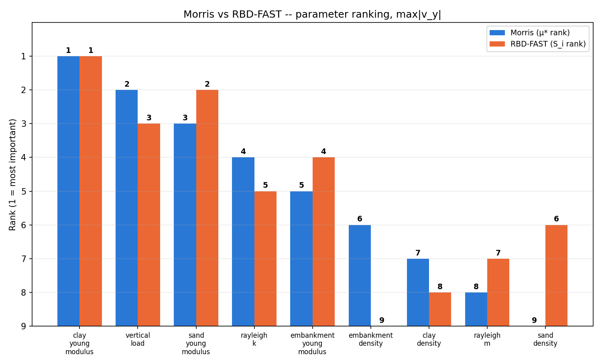
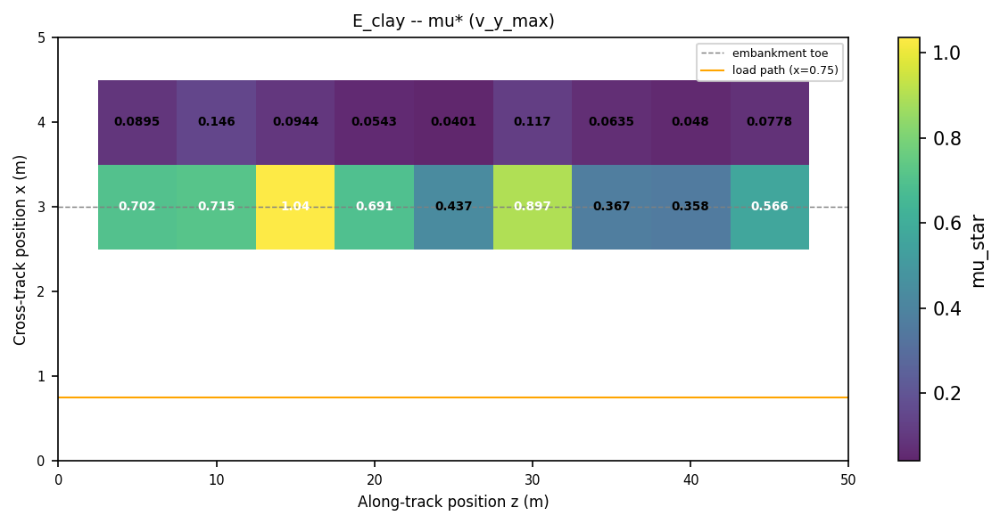
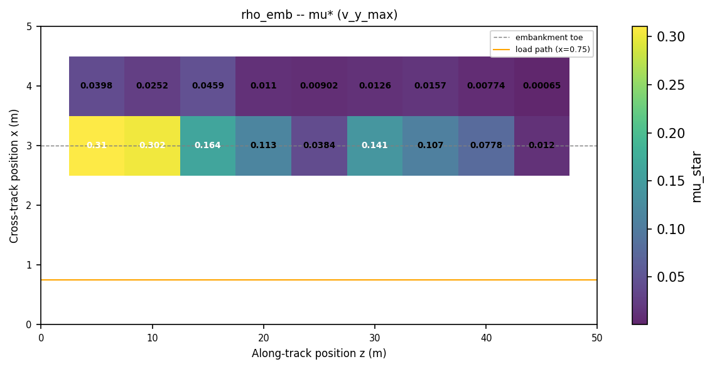
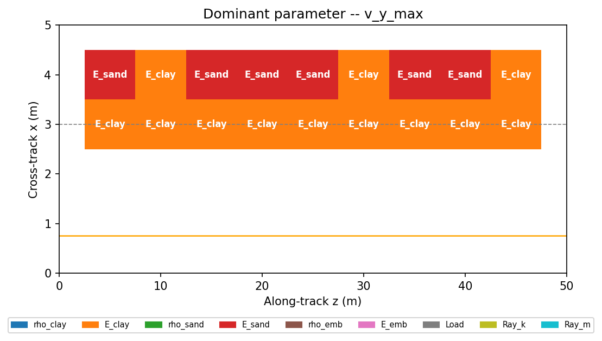

.. _tutorial_sensitivity:

STEMProb tutorial; probabilistic and sensitivity analysis of a 3D embankment model
========================================================================================

Overview
--------
This tutorial shows how to run uncertainty analyses on a STEM model of an
embankment under a moving load. The analyses show how much the vibration
response changes with uncertain soil, load and damping parameters. The
analyses also show which of those parameters matter most.

The tutorial has three parts:

1. **Build the base model**: a small, fast-running 3D moving-load model.
   Later steps re-run this model many times, once per sample.
2. **Uncertainty quantification**: Monte Carlo / Latin Hypercube sampling
   and Random Fields. These methods propagate realistic parameter and
   spatial uncertainty through the model and show the resulting output
   distribution.
3. **Sensitivity analysis**: screen which of the uncertain parameters
   matter most for the response.

The code blocks below build on each other, in order, within each part.
Paste them into a single script as you read, to reproduce a part's results
yourself. To skip ahead instead, each part has a complete, ready-to-run
script: ``docs/tutorial_sensitivity_model.py`` (Build the base model),
``docs/tutorial_sensitivity_base.py`` together with
``docs/tutorial_sensitivity_mc.py`` / ``docs/tutorial_sensitivity_rf.py``
(Uncertainty quantification), and ``docs/tutorial_sensitivity_morris.py``
(Sensitivity analysis). These scripts take real, unattended run time. The
Morris script alone runs STEM about 100 times. This run time is normal. It
is not a sign that something is wrong.

Build the base model
------------------

Imports and setup
------------------
First the necessary packages are imported and the input folder is defined.

.. code-block:: python

    input_files_dir = "tutorial_sensitivity_model"

    from stem.model import Model
    from stem.soil_material import OnePhaseSoil, LinearElasticSoil, SoilMaterial, SaturatedBelowPhreaticLevelLaw
    from stem.load import MovingLoad
    from stem.boundary import DisplacementConstraint
    from stem.output import NodalOutput, VtkOutputParameters, JsonOutputParameters
    from stem.solver import AnalysisType, SolutionType, TimeIntegration, DisplacementConvergenceCriteria, \
        NewtonRaphsonStrategy, NewmarkScheme, Amgcl, StressInitialisationType, SolverSettings, Problem
    from stem.stem import Stem

..    # END CODE BLOCK

Variables and their variation ranges
-------------------------------------
This tutorial varies nine parameters: the density and Young's modulus of
each of the three soil layers, the vertical load magnitude, and the two
Rayleigh damping coefficients. Poisson's ratio (0.2) and porosity (0.3)
stay fixed for all layers.

The table below lists, for each parameter, the reference ("mid-range")
value used to build the single deterministic model in this step. It also
lists the ``[min, max]`` range the Morris method samples from later. This
model is simplified, so revisit these ranges before an actual design case.
Ask whether they are realistic. Ask what the correct ranges should be for
a more representative model. The Uncertainty quantification part uses its
own, narrower uncertainty ranges around the same reference values; see
that part for details.

.. list-table::
   :header-rows: 1
   :widths: 24 14 20 20 22

   * - Parameter
     - Unit
     - Reference value
     - Morris range
     - Applies to
   * - ``clay_density``
     - kg/m3
     - 2000
     - [1000, 3000]
     - ``soil_layer_2`` (clay, under embankment)
   * - ``clay_young_modulus``
     - Pa
     - 60e6
     - [20e6, 100e6]
     - ``soil_layer_2``
   * - ``sand_density``
     - kg/m3
     - 2000
     - [1000, 3000]
     - ``soil_layer_1`` (sand, bottom layer)
   * - ``sand_young_modulus``
     - Pa
     - 250e6
     - [100e6, 400e6]
     - ``soil_layer_1``
   * - ``embankment_density``
     - kg/m3
     - 2000
     - [1000, 3000]
     - ``embankment_layer``
   * - ``embankment_young_modulus``
     - Pa
     - 100e6
     - [50e6, 150e6]
     - ``embankment_layer``
   * - ``vertical_load``
     - N
     - -30000
     - [-40000, -20000]
     - moving load magnitude
   * - ``rayleigh_k``
     - -
     - 5e-4
     - [1e-6, 1e-3]
     - stiffness-proportional damping
   * - ``rayleigh_m``
     - -
     - 0.5
     - [0.1, 0.9]
     - mass-proportional damping

.. code-block:: python

    reference_parameters = {
        "clay_density": 2000.0,
        "clay_young_modulus": 60e6,
        "sand_density": 2000.0,
        "sand_young_modulus": 250e6,
        "embankment_density": 2000.0,
        "embankment_young_modulus": 100e6,
        "vertical_load": -30000.0,
        "rayleigh_k": 5e-4,
        "rayleigh_m": 0.5,
    }

..    # END CODE BLOCK

Geometry and materials
------------------------
The geometry has two soil layers and an embankment on top. Coordinates
define each layer in the x-y plane. The model extrudes them 50 m in the
z-direction. The sand layer is the bottom layer (3 m thick). The clay layer
sits directly under the embankment (1 m thick). The embankment itself is a
sloped fill on top. Its crest is at ``x=0.75`` (where the track/load sits).
Its far toe is at ``x=3.0``.

.. code-block:: python

    ndim = 3
    model = Model(ndim)

..    # END CODE BLOCK

.. code-block:: python

    p = reference_parameters

    sand_formulation = OnePhaseSoil(ndim, IS_DRAINED=True, DENSITY_SOLID=p["sand_density"], POROSITY=0.3)
    sand_law = LinearElasticSoil(YOUNG_MODULUS=p["sand_young_modulus"], POISSON_RATIO=0.2)
    sand_material = SoilMaterial("sand", sand_formulation, sand_law, SaturatedBelowPhreaticLevelLaw())

    clay_formulation = OnePhaseSoil(ndim, IS_DRAINED=True, DENSITY_SOLID=p["clay_density"], POROSITY=0.3)
    clay_law = LinearElasticSoil(YOUNG_MODULUS=p["clay_young_modulus"], POISSON_RATIO=0.2)
    clay_material = SoilMaterial("clay", clay_formulation, clay_law, SaturatedBelowPhreaticLevelLaw())

    embankment_formulation = OnePhaseSoil(ndim, IS_DRAINED=True, DENSITY_SOLID=p["embankment_density"], POROSITY=0.3)
    embankment_law = LinearElasticSoil(YOUNG_MODULUS=p["embankment_young_modulus"], POISSON_RATIO=0.2)
    embankment_material = SoilMaterial("embankment", embankment_formulation, embankment_law,
                                       SaturatedBelowPhreaticLevelLaw())

..    # END CODE BLOCK

.. code-block:: python

    soil1_coordinates = [(0.0, -2.0, 0.0), (5.0, -2.0, 0.0), (5.0, 1.0, 0.0), (0.0, 1.0, 0.0)]        # sand
    soil2_coordinates = [(0.0, 1.0, 0.0), (5.0, 1.0, 0.0), (5.0, 2.0, 0.0), (0.0, 2.0, 0.0)]           # clay
    embankment_coordinates = [(0.0, 2.0, 0.0), (3.0, 2.0, 0.0), (1.5, 3.0, 0.0), (0.75, 3.0, 0.0), (0.0, 3.0, 0.0)]

    model.extrusion_length = 50.0
    model.add_soil_layer_by_coordinates(soil1_coordinates, sand_material, "soil_layer_1")
    model.add_soil_layer_by_coordinates(soil2_coordinates, clay_material, "soil_layer_2")
    model.add_soil_layer_by_coordinates(embankment_coordinates, embankment_material, "embankment_layer")

..    # END CODE BLOCK

Load
----
A single moving point load on the embankment crest stands in for the train.
This model has no rail, sleepers or UVEC vehicle model. The load travels at
30 m/s from ``[0.75, 3.0, 0.0]``.

.. code-block:: python

    load_coordinates = [(0.75, 3.0, 0.0), (0.75, 3.0, 50.0)]
    moving_load = MovingLoad(load=[0.0, p["vertical_load"], 0.0], direction_signs=[1, 1, 1],
                             velocity=30, origin=[0.75, 3.0, 0.0], offset=0.0)
    model.add_load_by_coordinates(load_coordinates, moving_load, "moving_load")

..    # END CODE BLOCK

Why this model is deliberately small
.....................................
Uncertainty analyses need many independent model evaluations, not a single
run. To keep run time affordable, this tutorial reduces the model in every
dimension that drives run time:

* a narrow, 5 m wide soil cross-section, extruded only 50 m along the track,
* a coarse 1 m mesh (``element_size=1.0``),
* a short analysis duration of 2 s with a relatively large 0.1 s time step,
* a single moving point load standing in for the train (no rail, sleepers or
  UVEC vehicle model),
* no absorbing boundaries on the sides of the domain.

These reductions mean the model does not represent a real vibration
assessment. The domain is too short and narrow. The mesh is too coarse. The
time step is too large to capture the frequency content a real assessment
needs. The model exists only to run fast, many times over, so this tutorial
can demonstrate the methods themselves.

Output points
-------------
STEM records the response at whichever coordinates are given here. As an
example, this tutorial uses a single point at the toe of the embankment,
roughly midway along the track (``x=3.0``, ``y=2.0``, ``z=25``). Every step
below tracks the vertical velocity (*v_y*) at this point. This is only an
example choice. For an actual design, choose the output point(s) based on
where the response matters, for example a building or receiver location.
That location may well be different from the one used here.

.. code-block:: python

    output_coordinates = [
        (3.0, 2.0, 25.0),   # toe of embankment, example point
    ]
    nodal_results = [NodalOutput.DISPLACEMENT, NodalOutput.VELOCITY]

    model.add_output_settings_by_coordinates(
        coordinates=output_coordinates,
        part_name="sensitivity_output",
        output_parameters=JsonOutputParameters(
            output_interval=0.1,
            nodal_results=nodal_results,
            gauss_point_results=[],
        ),
        output_dir="output",
        output_name="sensitivity_output",
    )

..    # END CODE BLOCK

Adding output settings by coordinates alters the geometry. Synchronise the
geometry again afterwards. This is also a convenient point to check the
generated surface ids. The boundary conditions below need these ids.

.. code-block:: python

    model.synchronise_geometry()
    model.show_geometry(show_surface_ids=True)

..    # END CODE BLOCK

Boundary conditions, mesh and solver settings
------------------------------------------------
The rest of the setup is standard STEM configuration. It has a fixed base
with roller sides, and no absorbing boundaries (see the note above on why
this model does not represent a real assessment). It uses a coarse
1 m mesh, and a short 2 s dynamic analysis with a 0.1 s time step, with the
reference Rayleigh damping values. The output interval above matches this
0.1 s step. A finer value would have no effect, because STEM cannot report
results between solver steps. A 0.1 s step is fairly coarse: its Nyquist
frequency is 5 Hz, so it would understate higher-frequency content in a real
assessment. This tutorial accepts that limit to keep run times short for
repeated sampling; Monte Carlo, Morris, and RF ensembles all need many runs.

.. code-block:: python

    # Boundary conditions: fixed base, roller sides (x/z fixed, y free)
    no_displacement_parameters = DisplacementConstraint(is_fixed=[True, True, True], value=[0, 0, 0])
    roller_displacement_parameters = DisplacementConstraint(is_fixed=[True, False, True], value=[0, 0, 0])
    model.add_boundary_condition_by_geometry_ids(2, [1], no_displacement_parameters, "base_fixed")
    model.add_boundary_condition_by_geometry_ids(2, [2, 4, 5, 6, 7, 10, 11, 12, 15, 16, 17],
                                                 roller_displacement_parameters, "sides_roller")

    # Mesh: coarse, uniform element size
    model.set_mesh_size(element_size=1.0)

    # Solver settings: short dynamic analysis, constant matrices, reference Rayleigh damping
    analysis_type = AnalysisType.MECHANICAL
    solution_type = SolutionType.DYNAMIC
    time_integration = TimeIntegration(start_time=0.0, end_time=2.0, delta_time=0.1,
                                       reduction_factor=1.0, increase_factor=1.0)
    convergence_criterion = DisplacementConvergenceCriteria(displacement_relative_tolerance=1.0e-4,
                                                            displacement_absolute_tolerance=1.0e-9)
    strategy_type = NewtonRaphsonStrategy()
    scheme_type = NewmarkScheme()
    linear_solver_settings = Amgcl()
    stress_initialisation_type = StressInitialisationType.NONE

    solver_settings = SolverSettings(analysis_type=analysis_type, solution_type=solution_type,
                                     stress_initialisation_type=stress_initialisation_type,
                                     time_integration=time_integration,
                                     is_stiffness_matrix_constant=True, are_mass_and_damping_constant=True,
                                     convergence_criteria=convergence_criterion,
                                     strategy_type=strategy_type, scheme=scheme_type,
                                     linear_solver_settings=linear_solver_settings,
                                     rayleigh_k=p["rayleigh_k"], rayleigh_m=p["rayleigh_m"])

    # Problem definition and VTK output (for visual inspection in Paraview)
    problem = Problem(problem_name="tutorial_sensitivity_base_model", number_of_threads=1,
                      settings=solver_settings)
    model.project_parameters = problem

    model.add_output_settings(
        part_name="porous_computational_model_part",
        output_name="vtk_output",
        output_dir="output",
        output_parameters=VtkOutputParameters(
            output_interval=1,
            nodal_results=nodal_results,
            gauss_point_results=[],
            output_control_type="step"
        )
    )

..    # END CODE BLOCK

Running the base model
------------------------
The model is now complete. Run the calculation once, using the reference
parameter values. This confirms the model is set up correctly before the
probabilistic analyses.

.. code-block:: python

    stem = Stem(model, input_files_dir)
    stem.write_all_input_files()
    stem.run_calculation()

..    # END CODE BLOCK

Wrapping the model as a function
-----------------------------------
Every step from here on repeats this model many times with different
parameter values: Monte Carlo, Random Field, and sensitivity analysis all
work this way. It is convenient to wrap the model into two plain functions.
One function builds the model from a set of parameter values. The other
function runs the model and reduces the result to a single number.

``build_model`` below builds the same model as above: materials, geometry,
load, output point, boundary conditions, mesh, and solver settings. All nine
table parameters are now arguments instead of fixed reference values. The
function also takes two optional arguments, ``rf_seed`` and its settings
``rf_cov``/``rf_anisotropy``, used later by the Random Field part. When
``rf_seed`` is given, the function applies a spatial random field to the
clay layer's Young's modulus, on top of the ``clay_young_modulus`` value.
This uses the same ``RandomFieldGenerator`` mechanism as tutorial 4.
``run_model`` builds the model, runs it, and reads back the ``VELOCITY_Y``
time series at the output point. It reduces that time series to its peak
absolute value, ``max(|v_y|)``. That reduction is only an example. Depending
on what the study needs to answer, a different output point, a different
recorded quantity, or a different way to summarise the time series may fit
better.

The two random-field helper functions below, ``create_random_field_generator``
and ``create_parameter_field_parameters``, live in
``docs/random_field_utils.py`` and ``docs/parameter_field_utils.py``. These
are small wrappers that make the ``RandomFieldGenerator``/
``ParameterFieldParameters`` construction robust across STEM versions. Keep
those two files alongside your script; they ship in ``docs/`` next to this
tutorial.

.. code-block:: python

    import os
    import json
    import numpy as np
    from random_field_utils import create_random_field_generator
    from parameter_field_utils import create_parameter_field_parameters

    OUTPUT_POINT = (3.0, 2.0, 25.0)  # same point as above

    def build_model(clay_density, clay_young_modulus, sand_density, sand_young_modulus,
                     embankment_density, embankment_young_modulus, vertical_load,
                     rayleigh_k, rayleigh_m,
                     rf_seed=None, rf_cov=0.1, rf_anisotropy=10.0) -> Model:
        ndim = 3
        model = Model(ndim)

        sand_formulation = OnePhaseSoil(ndim, IS_DRAINED=True, DENSITY_SOLID=sand_density, POROSITY=0.3)
        sand_law = LinearElasticSoil(YOUNG_MODULUS=sand_young_modulus, POISSON_RATIO=0.2)
        sand_material = SoilMaterial("sand", sand_formulation, sand_law, SaturatedBelowPhreaticLevelLaw())

        clay_formulation = OnePhaseSoil(ndim, IS_DRAINED=True, DENSITY_SOLID=clay_density, POROSITY=0.3)
        clay_law = LinearElasticSoil(YOUNG_MODULUS=clay_young_modulus, POISSON_RATIO=0.2)
        clay_material = SoilMaterial("clay", clay_formulation, clay_law, SaturatedBelowPhreaticLevelLaw())

        embankment_formulation = OnePhaseSoil(ndim, IS_DRAINED=True, DENSITY_SOLID=embankment_density, POROSITY=0.3)
        embankment_law = LinearElasticSoil(YOUNG_MODULUS=embankment_young_modulus, POISSON_RATIO=0.2)
        embankment_material = SoilMaterial("embankment", embankment_formulation, embankment_law,
                                           SaturatedBelowPhreaticLevelLaw())

        soil1_coordinates = [(0.0, -2.0, 0.0), (5.0, -2.0, 0.0), (5.0, 1.0, 0.0), (0.0, 1.0, 0.0)]
        soil2_coordinates = [(0.0, 1.0, 0.0), (5.0, 1.0, 0.0), (5.0, 2.0, 0.0), (0.0, 2.0, 0.0)]
        embankment_coordinates = [(0.0, 2.0, 0.0), (3.0, 2.0, 0.0), (1.5, 3.0, 0.0), (0.75, 3.0, 0.0), (0.0, 3.0, 0.0)]

        model.extrusion_length = 50.0
        model.add_soil_layer_by_coordinates(soil1_coordinates, sand_material, "soil_layer_1")
        model.add_soil_layer_by_coordinates(soil2_coordinates, clay_material, "soil_layer_2")
        model.add_soil_layer_by_coordinates(embankment_coordinates, embankment_material, "embankment_layer")

        if rf_seed is not None:
            random_field_generator = create_random_field_generator(
                dim=3, cov=rf_cov, model_name="Gaussian", v_scale_fluctuation=1,
                anisotropy=[rf_anisotropy], angle=[0], seed=rf_seed,
            )
            field_parameters = create_parameter_field_parameters(
                property_name="YOUNG_MODULUS", function_type="json_file",
                field_generator=random_field_generator,
            )
            model.add_field(part_name="soil_layer_2", field_parameters=field_parameters)

        load_coordinates = [(0.75, 3.0, 0.0), (0.75, 3.0, 50.0)]
        moving_load = MovingLoad(load=[0.0, vertical_load, 0.0], direction_signs=[1, 1, 1],
                                 velocity=30, origin=[0.75, 3.0, 0.0], offset=0.0)
        model.add_load_by_coordinates(load_coordinates, moving_load, "moving_load")

        model.add_output_settings_by_coordinates(
            coordinates=[OUTPUT_POINT],
            part_name="sensitivity_output",
            output_parameters=JsonOutputParameters(
                output_interval=0.1,
                nodal_results=[NodalOutput.VELOCITY],
                gauss_point_results=[],
            ),
            output_dir="output",
            output_name="sensitivity_output",
        )
        model.synchronise_geometry()

        no_displacement_parameters = DisplacementConstraint(is_fixed=[True, True, True], value=[0, 0, 0])
        roller_displacement_parameters = DisplacementConstraint(is_fixed=[True, False, True], value=[0, 0, 0])
        model.add_boundary_condition_by_geometry_ids(2, [1], no_displacement_parameters, "base_fixed")
        model.add_boundary_condition_by_geometry_ids(2, [2, 4, 5, 6, 7, 10, 11, 12, 15, 16, 17],
                                                     roller_displacement_parameters, "sides_roller")

        model.set_mesh_size(element_size=1.0)

        time_integration = TimeIntegration(start_time=0.0, end_time=2.0, delta_time=0.1,
                                           reduction_factor=1.0, increase_factor=1.0)
        convergence_criterion = DisplacementConvergenceCriteria(displacement_relative_tolerance=1.0e-4,
                                                                displacement_absolute_tolerance=1.0e-9)
        solver_settings = SolverSettings(analysis_type=AnalysisType.MECHANICAL, solution_type=SolutionType.DYNAMIC,
                                         stress_initialisation_type=StressInitialisationType.NONE,
                                         time_integration=time_integration,
                                         is_stiffness_matrix_constant=True, are_mass_and_damping_constant=True,
                                         convergence_criteria=convergence_criterion,
                                         strategy_type=NewtonRaphsonStrategy(), scheme=NewmarkScheme(),
                                         linear_solver_settings=Amgcl(),
                                         rayleigh_k=rayleigh_k, rayleigh_m=rayleigh_m)

        model.project_parameters = Problem(problem_name="tutorial_sensitivity_probabilistic", number_of_threads=1,
                                           settings=solver_settings)
        return model

    def run_model(parameters, rf_seed=None, rf_cov=0.1, rf_anisotropy=10.0) -> dict:
        model = build_model(*parameters, rf_seed=rf_seed, rf_cov=rf_cov, rf_anisotropy=rf_anisotropy)
        stem = Stem(model, input_files_dir)
        stem.write_all_input_files()
        stem.run_calculation()

        with open(os.path.join(input_files_dir, "output", "sensitivity_output.json")) as f:
            results = json.load(f)

        node_key = next(k for k in results if k.startswith("NODE_"))
        v_y = np.asarray(results[node_key]["VELOCITY_Y"], dtype=float)
        return {"time": results["TIME"], "v_y": v_y, "v_y_max": float(np.max(np.abs(v_y)))}

..    # END CODE BLOCK

This ``build_model`` / ``run_model`` pair is also saved for reference in
``docs/tutorial_sensitivity_base.py``. Every remaining code block in this
tutorial calls this pair. No further redefinition is needed from here on.

Uncertainty quantification
------------------------------
A natural starting point for studying uncertainty in the model is this
question: given the believed uncertainty in these parameters, what does the
response look like? This means the full distribution, not just a single
number. Monte Carlo (MC) can answer that directly. Draw many parameter sets
from their uncertainty distributions, run the model for each set, and look
at the resulting spread of outputs. Use this method when the goal is to see
the distribution of results over the uncertain parameters, for example to
estimate a probability of exceeding a vibration limit. This tutorial does
this with either crude Monte Carlo or Latin Hypercube sampling, described
below.

This part reuses ``build_model`` and ``run_model`` unchanged.

Monte Carlo and Latin Hypercube sampling
............................................
Sampling needs realistic uncertainty. Material properties get a lognormal
distribution, since they must stay positive. Load and damping get a normal
distribution. Both use a 5% coefficient of variation (COV) around the
reference values. This is an example choice. No geotechnical survey has
validated it.

.. list-table::
   :header-rows: 1
   :widths: 30 20 15 20

   * - Parameter
     - Distribution
     - Mean
     - COV
   * - clay/sand/embankment density, Young's modulus
     - lognormal
     - reference value
     - 5%
   * - ``vertical_load``, ``rayleigh_k``, ``rayleigh_m``
     - normal
     - reference value
     - 5%

The code below defines the same nine distributions, plus a helper that maps
a Uniform[0,1] draw to a physical parameter value through that parameter's
inverse CDF. This helper makes crude Monte Carlo and LHS interchangeable
further down. Both methods produce a Uniform[0,1] array, only with
different coverage of the 9-dimensional space. This same function converts
either array to physical units.

.. code-block:: python

    from scipy import stats

    DISTRIBUTIONS = {
        "clay_density":             {"mean": 2000.0, "cov": 0.05, "dist": "lognormal"},
        "clay_young_modulus":       {"mean": 60e6,   "cov": 0.05, "dist": "lognormal"},
        "sand_density":              {"mean": 2000.0, "cov": 0.05, "dist": "lognormal"},
        "sand_young_modulus":       {"mean": 250e6,  "cov": 0.05, "dist": "lognormal"},
        "embankment_density":       {"mean": 2000.0, "cov": 0.05, "dist": "lognormal"},
        "embankment_young_modulus": {"mean": 100e6,  "cov": 0.05, "dist": "lognormal"},
        "vertical_load":             {"mean": -30000.0, "cov": 0.05, "dist": "normal"},
        "rayleigh_k":                {"mean": 5e-4,     "cov": 0.05, "dist": "normal"},
        "rayleigh_m":                {"mean": 0.5,      "cov": 0.05, "dist": "normal"},
    }
    NAMES = list(DISTRIBUTIONS.keys())

    def uniform_to_parameters(u: np.ndarray) -> np.ndarray:
        out = np.empty_like(u)
        for i, name in enumerate(NAMES):
            d = DISTRIBUTIONS[name]
            if d["dist"] == "lognormal":
                sigma_ln = np.sqrt(np.log(1 + d["cov"] ** 2))
                mu_ln = np.log(d["mean"]) - 0.5 * sigma_ln ** 2
                out[:, i] = stats.lognorm.ppf(u[:, i], s=sigma_ln, scale=np.exp(mu_ln))
            else:  # normal
                std = abs(d["mean"]) * d["cov"]
                out[:, i] = stats.norm.ppf(u[:, i], loc=d["mean"], scale=std)
        return out

..    # END CODE BLOCK

There is more than one way to turn ``N`` draws from Uniform[0,1] per
parameter into a sample set:

* **Crude Monte Carlo** draws each parameter independently, ``N`` times.
  This is simple, but for a modest ``N`` the samples can clump together and
  leave gaps in the parameter space.
* **Latin Hypercube Sampling (LHS)** splits each parameter's range into
  ``N`` equal-probability bins, and draws exactly one sample per bin. This
  spreads the ``N`` samples more evenly across the space. For the same
  sample budget, LHS usually gives a more stable estimate of the output
  distribution than crude Monte Carlo does.

Either method can be used here. Both produce an ``(N, 9)`` array of
Uniform[0,1] draws. The code then maps that array to physical parameter
values through each parameter's inverse CDF; see ``uniform_to_parameters``
in the script below. This tutorial uses LHS.

.. code-block:: python

    from scipy.stats import qmc

    N = 30
    sampler = qmc.LatinHypercube(d=9, seed=42)
    u = sampler.random(n=N)                 # (30, 9) array in [0, 1]
    samples = uniform_to_parameters(u)      # -> physical parameter values

    v_y_max = np.empty(N)
    for i, sample in enumerate(samples):
        v_y_max[i] = run_model(sample)["v_y_max"]

..    # END CODE BLOCK

The histogram below is drawn from ``v_y_max`` with a fitted lognormal curve.
This tutorial uses this same style throughout:

.. code-block:: python

    import matplotlib.pyplot as plt

    v = v_y_max * 1000  # mm/s
    mu_v, sd_v = v.mean(), v.std(ddof=1)
    ln_shape, ln_loc, ln_scale = stats.lognorm.fit(v, floc=0)
    x_fit = np.linspace(v.min() * 0.7, v.max() * 1.3, 400)

    os.makedirs("sensitivity_plots", exist_ok=True)
    fig, ax = plt.subplots(figsize=(7.5, 4.8))
    ax.hist(v, bins=max(8, N // 4), density=True, color="#a8dadc", edgecolor="white",
            alpha=0.85, label=f"lhs samples (N = {N})")
    ax.plot(x_fit, stats.lognorm.pdf(x_fit, ln_shape, ln_loc, ln_scale), color="#1d3557",
            lw=2.2, label=fr"Lognormal fit ($\sigma_\ln$ = {ln_shape:.3f})")
    ax.axvline(mu_v, color="#457b9d", ls=":", lw=1.6,
               label=fr"Mean: {mu_v:.4f} mm/s (CV = {sd_v / mu_v * 100:.0f} %)")
    ax.set_xlabel(r"max$|v_y|$ (mm/s)")
    ax.set_ylabel("Probability density")
    ax.legend(fontsize=9, loc="upper right", framealpha=0.9)
    fig.savefig("sensitivity_plots/tutorial_sensitivity_mc_histogram_lhs.png", dpi=150)

..    # END CODE BLOCK

The figure below is the actual output of this code, with ``N=30`` and the
distributions and settings documented above.

.. image:: _static/tutorial_sensitivity_mc_histogram_lhs.png
    :align: center
    :alt: Histogram of max|v_y| over 30 LHS samples with a lognormal fit.

Across the 30 samples, ``max|v_y|`` at the toe-of-embankment point ranges
from 0.162 to 0.215 mm/s. The mean is 0.189 mm/s, and the coefficient of
variation is about 7%. In other words: for this reduced model, with this
limited number of samples, a 5% COV on each of the nine input parameters
gives roughly 7% COV on the response at this point.

Random Field
............................................
So far every parameter has been a single value per soil layer, uniform
across the whole domain: a deterministic model. In reality, soil properties
vary spatially. STEM can generate a spatially correlated random field for a
chosen material property directly. This is the same mechanism used in
tutorial_cpt_random_fields/docs/index.rst. Here, RF is applied only to the
clay layer's Young's modulus (``soil_layer_2``). The other eight parameters
stay fixed at their Step 1 reference values.

.. list-table::
   :header-rows: 1
   :widths: 30 70

   * - Setting
     - Used here
   * - Property
     - ``clay_young_modulus`` (``soil_layer_2``)
   * - Field model
     - Gaussian
   * - Coefficient of variation
     - 0.1
   * - Horizontal correlation length (anisotropy)
     - 10 m
   * - Seed
     - 14 (single example run below); a range of seeds for the distribution

.. code-block:: python

    result = run_model(list(reference_parameters.values()), rf_seed=14, rf_cov=0.1, rf_anisotropy=10.0)

..    # END CODE BLOCK

.. image:: _static/tutorial_sensitivity_rf_field_map.png
    :align: center
    :alt: Spatially-varying Young's modulus field on the clay layer for one random field realisation.

The colour scale above illustrates the spatial uncertainty. It shows what a
Gaussian random field on a soil layer's Young's modulus looks like: a
smoothly varying field, not a single uniform value.

A single run gives only one realisation of the field. As with Monte Carlo,
repeating the run over a set of seeds, with all other parameters unchanged,
builds up a distribution of the response. Two reference values are added
alongside that distribution: the seed-14 run already computed above, and a
deterministic run with the same reference parameters and no random field at
all. That deterministic run is the same calculation as "Running the base
model" earlier.

.. code-block:: python

    reference_parameters_list = list(reference_parameters.values())

    seeds = list(range(1, 21))
    rf_v_y_max = np.empty(len(seeds))
    for i, seed in enumerate(seeds):
        rf_v_y_max[i] = run_model(reference_parameters_list, rf_seed=seed, rf_cov=0.1, rf_anisotropy=10.0)["v_y_max"]

    seed14_value = float(rf_v_y_max[seeds.index(14)])
    deterministic_value = run_model(reference_parameters_list)["v_y_max"]  # rf_seed=None -> no RF

    v = rf_v_y_max * 1000  # mm/s
    ln_shape, ln_loc, ln_scale = stats.lognorm.fit(v, floc=0)
    x_fit = np.linspace(v.min() * 0.7, v.max() * 1.3, 400)

    os.makedirs("sensitivity_plots", exist_ok=True)
    fig, ax = plt.subplots(figsize=(7.5, 4.8))
    ax.hist(v, bins=max(8, len(seeds) // 4), density=True, color="#a8dadc", edgecolor="white",
            alpha=0.85, label=f"rf samples (N = {len(seeds)})")
    ax.plot(x_fit, stats.lognorm.pdf(x_fit, ln_shape, ln_loc, ln_scale), color="#1d3557",
            lw=2.2, label=fr"Lognormal fit ($\sigma_\ln$ = {ln_shape:.3f})")
    ax.axvline(seed14_value * 1000, color="#e63946", ls="--", lw=1.8,
               label=f"Seed 14: {seed14_value * 1000:.4f} mm/s")
    ax.axvline(deterministic_value * 1000, color="#457b9d", ls="-", lw=1.8,
               label=f"Deterministic (no RF): {deterministic_value * 1000:.4f} mm/s")
    ax.set_xlabel(r"max$|v_y|$ (mm/s)")
    ax.set_ylabel("Probability density")
    ax.legend(fontsize=9, loc="upper right", framealpha=0.9)
    fig.savefig("sensitivity_plots/tutorial_sensitivity_rf_histogram.png", dpi=150)

..    # END CODE BLOCK

The figure below is the actual output of this code, with 20 random field
realisations, seeds 1 to 20, and the settings documented above.

.. image:: _static/tutorial_sensitivity_rf_histogram.png
    :align: center
    :alt: Histogram of max|v_y| over 20 random field realisations, with reference lines for seed 14 and the deterministic (no RF) run.

The red dashed line marks the single-example run above: seed 14,
0.1804 mm/s. The blue solid line marks the deterministic run, with the same
reference parameters and no random field at all: 0.1883 mm/s. That
deterministic run is the same calculation as "Running the base model" in the
first part of this tutorial. Across the 20 realisations, ``max|v_y|``
ranges from 0.171 to 0.223 mm/s, with a mean of 0.190 mm/s and a CoV of
about 7%. This is close to the Monte Carlo spread above, even though only
one property, the clay Young's modulus, varies here, and it varies
spatially, not as a single value like all nine parameters in the Monte
Carlo study. This is not a general result. It depends on this particular
model, output point, and choice of RF settings. But it illustrates why a
Random Field study is worth doing: spatial variability alone, at a
realistic COV and correlation length, can be a significant source of
response variability in its own right, separate from the
parameter-to-parameter uncertainty covered above.

Applying sensitivity analysis
-------------------------------------
This part introduces two sensitivity analysis methods: Morris and RBD-FAST.
For details of the theory, see Saltelli, A., Ratto, M., Andres, T.,
Campolongo, F., Cariboni, J., Gatelli, D., Saisana, M., and Tarantola, S.
(2008), *Global Sensitivity Analysis: The Primer*, John Wiley & Sons.

Morris is a screening method. It runs the model many times, each time
nudging one parameter at a time along a random path through the parameter
space. It uses the resulting changes in the output, the "elementary
effects", to rank which parameters matter most. It needs far fewer runs
than a full variance-based method, such as the Sobol' method, would need.

This step reuses ``build_model`` and ``run_model`` from Step 1. It also uses
a ``problem`` definition holding the nine parameter names and Morris ranges
from the table earlier.

Morris settings
---------------------------
Generating the trajectories and computing the sensitivity indices from them
is controlled by a handful of settings.

.. list-table::
   :header-rows: 1
   :widths: 20 55 25

   * - Setting
     - What it controls
     - Used here
   * - ``N``
     - Number of trajectories, *r*. Total STEM runs = *N × (num_vars + 1)*.
       More trajectories -> smoother, more reliable indices, at the cost of
       proportionally more runs.
     - 10 (100 runs total)
   * - ``num_levels``
     - Number of levels, *p*, in the grid each parameter is discretised
       into. Each elementary-effect step covers *p / (2(p-1))* of the
       parameter's full range. Must be even for the standard Morris design.
     - 4
   * - ``scaled``
     - Whether the output values are standardised before computing the
       indices. Left ``False`` here so *μ*/*μ*\*/*σ* stay in
       the physical units of ``max(|v_y|)``.
     - ``False``
   * - ``seed`` (sampling)
     - RNG seed for the trajectory design, for reproducibility.
     - 42
   * - ``seed`` (analysis)
     - Seed used internally when computing the indices; independent of the
       sampling seed.
     - 42

.. code-block:: python

    from SALib.sample import morris as morris_sample
    from SALib.analyze import morris as morris_analyze

    problem = {
        "num_vars": 9,
        "names": ["clay_density", "clay_young_modulus", "sand_density", "sand_young_modulus",
                  "embankment_density", "embankment_young_modulus", "vertical_load",
                  "rayleigh_k", "rayleigh_m"],
        "bounds": [[1000, 3000], [20e6, 100e6], [1000, 3000], [100e6, 400e6],
                  [1000, 3000], [50e6, 150e6], [-40000, -20000], [1e-6, 1e-3], [0.1, 0.9]],
    }

    N = 10
    num_levels = 4
    samples = morris_sample.sample(problem, N=N, num_levels=num_levels, seed=42)
    # len(samples) == N * (problem["num_vars"] + 1) == 100

..    # END CODE BLOCK

Another method: RBD-FAST
----------------------------
RBD-FAST (Random Balanced Design - Fourier Amplitude Sensitivity Test) is a
variance-based sensitivity method. It estimates each parameter's first-order
Sobol' index *S_i* directly from an ordinary random or LHS sample. *S_i* is
the fraction of output variance explained by that parameter alone. Real
results for this method are shown further below, screened against the same
nine parameters and the same output point as the Morris run above.

.. list-table::
   :header-rows: 1
   :widths: 24 38 38

   * -
     - Morris
     - RBD-FAST
   * - Output
     - Elementary-effects ranking (*μ*, *μ*\*, *σ*)
     - First-order Sobol' index *S_i* per parameter (normalised, 0-1)
   * - Sampling
     - Its own trajectory design
     - Any independent random/LHS sample
   * - Interactions
     - Flagged qualitatively via *σ*
     - Not captured (*S_i* is first-order only)
   * - Best for
     - Cheap screening of many parameters
     - A normalised importance measure from samples already on hand

Sensitivity analysis workflow
---------------------
Each row of ``samples`` is one full STEM run. Once every output is
collected, one call computes the indices.

.. code-block:: python

    outputs = np.empty(len(samples))
    for i, sample in enumerate(samples):
        outputs[i] = run_model(sample)["v_y_max"]

    Si = morris_analyze.analyze(problem, samples, outputs, num_levels=num_levels,
                                scaled=False, seed=42, print_to_console=True)

..    # END CODE BLOCK

Interpreting the Morris results
----------------------------------
``Si`` holds three arrays, one value per parameter:

* *μ* is the signed mean elementary effect. A **positive** value means
  that increasing that parameter tends to increase ``max(|v_y|)`` on
  average, across the sampled trajectories. A **negative** value means
  that increasing it tends to decrease the response.
* *μ*\* is the mean of the absolute elementary effects. Unlike *μ*,
  opposite-signed effects from different trajectories do not cancel out.
  This makes *μ*\* the more reliable overall importance ranking,
  especially for non-monotonic responses.
* *σ* is the standard deviation of the elementary effects. A large *σ*
  relative to *μ*\* means the parameter's effect is not constant across
  the parameter space. It is either nonlinear on its own, or it interacts
  with other parameters.

The *μ* vs *σ* scatter is a standard way to see this at a glance. Points
far from the dashed zero line have a strong average effect. Points high up
on the *σ* axis have an effect that varies a lot across the sampled
trajectories. This means the effect is nonlinear, or it interacts with
other parameters, or both. Points near the origin, on both axes, are
comparatively unimportant over the ranges screened here.

.. code-block:: python

    import matplotlib.pyplot as plt

    mu, sigma = np.asarray(Si["mu"]), np.asarray(Si["sigma"])
    rank_by_abs_mu = np.argsort(np.argsort(-np.abs(mu))) + 1  # 1 = largest |mu|

    fig, ax = plt.subplots(figsize=(9, 8))
    sc = ax.scatter(mu, sigma, c=rank_by_abs_mu, cmap="viridis_r", s=110, edgecolors="k")
    ax.axvline(0, color="grey", linestyle="--")
    for name, x, y in zip(problem["names"], mu, sigma):
        ax.annotate(name, (x, y), textcoords="offset points", xytext=(0, 10), ha="center")
    ax.set_xlabel(r"$\mu$ (Mean Elementary Effect)")
    ax.set_ylabel(r"$\sigma$ (Standard Deviation of Elementary Effect)")
    fig.colorbar(sc, ax=ax, label="Importance ranking by |mu| (1 = largest)")
    fig.savefig("sensitivity_plots/tutorial_sensitivity_morris_mu_sigma.png", dpi=150)

..    # END CODE BLOCK

Results
----------
The figure below is the actual output of
``docs/tutorial_sensitivity_morris.py``, run with the settings documented
above: ``N=10``, ``num_levels=4``, 100 STEM runs. It screens all nine
parameters against ``max(|v_y|)`` at the toe-of-embankment / track-midpoint
point.

.. image:: _static/tutorial_sensitivity_morris_mu_sigma.png
    :align: center
    :alt: Morris μ vs σ scatter for max|v_y| at the toe-of-embankment output point.

Colour encodes the importance ranking by *|μ|* alone: 1 is largest, shown
yellow. 9 is smallest, shown dark purple. This is a quick ranking cue on
top of the two axes. It does not account for the nonlinearity or
interaction that *σ* captures separately.

By that ranking, ``clay_young_modulus``, ``vertical_load``,
``sand_young_modulus``, and ``rayleigh_k`` are the four largest drivers of
``max|v_y|`` at this point. All four also sit highest on the *σ* axis: their
effect is not just large on average, it also varies substantially across
the sampled trajectories. All four have a **negative** *μ*. Increasing clay
or sand stiffness, or increasing the stiffness-proportional damping
``rayleigh_k``, tends to decrease the response. Increasing ``vertical_load``
also decreases it, because this makes the downward load less negative, so
physically smaller. Equivalently, a larger load magnitude increases the
response, which matches physical expectation. The remaining five
parameters (``embankment_young_modulus``, ``embankment_density``,
``clay_density``, ``rayleigh_m``, ``sand_density``) have small, positive
*μ*, and sit close to the origin on both axes. These five are
comparatively unimportant over the ranges screened here.

With only ``N=10`` trajectories, this is still a modest screening run.
Combined with the reduced model size discussed above, treat this ranking as
an illustration of the workflow, not a converged, design-ready result. A
more reliable screening needs a larger ``N`` (for example 20-50) and a more
representative model.

RBD-FAST results
--------------------
This section checks how closely RBD-FAST agrees with the Morris ranking
above. RBD-FAST runs here with ``N=100`` independent LHS samples over the
same nine parameters and bounds, at the same output point, and screens the
same quantity, ``max(|v_y|)``. Unlike Morris, RBD-FAST needs an independent
sample. It does not use a trajectory design.

.. list-table::
   :header-rows: 1
   :widths: 20 55 25

   * - Setting
     - What it controls
     - Used here
   * - ``N``
     - Number of independent LHS samples. More samples -> a smoother
       spectral estimate of each parameter's *S_i*, at the cost of
       proportionally more runs.
     - 100 (100 runs total)
   * - ``M``
     - Number of harmonics used in the underlying Fourier decomposition.
       SALib's default is used here.
     - 10

.. code-block:: python

    from scipy.stats import qmc
    from SALib.analyze import rbd_fast as rbd_fast_analyze

    bounds = np.array(problem["bounds"])
    sampler = qmc.LatinHypercube(d=problem["num_vars"], seed=42)
    samples = qmc.scale(sampler.random(n=100), bounds[:, 0], bounds[:, 1])

    outputs = np.empty(len(samples))
    for i, sample in enumerate(samples):
        outputs[i] = run_model(sample)["v_y_max"]

    Si = rbd_fast_analyze.analyze(problem, samples, outputs, M=10, print_to_console=True)

..    # END CODE BLOCK

``Si["S1"]`` (denoted *S_i* below) is the one value per parameter this
method produces: the fraction of output variance attributable to that
parameter alone. Unlike Morris's *μ*/*μ*\*/*σ* triple, there
is no separate measure of nonlinearity or interaction. A large gap
between the sum of all *S_i* values and 1 would suggest parameter
interactions RBD-FAST cannot see on its own.

``docs/tutorial_sensitivity_rbd_fast.py`` runs this with the settings above
(``N=100``, ``M=10``, 100 STEM runs), and screens the same nine parameters
against ``max(|v_y|)`` at the same toe-of-embankment / track-midpoint point
as the Morris run.

RBD-FAST and Morris agree on which five parameters matter most:
``clay_young_modulus``, ``vertical_load``, ``sand_young_modulus``,
``rayleigh_k``, and ``embankment_young_modulus``. They also agree on which
four matter least: ``embankment_density``, ``clay_density``,
``rayleigh_m``, and ``sand_density``. The two methods only swap adjacent
ranks within each group. For example, Morris ranks ``vertical_load`` above
``sand_young_modulus``, and RBD-FAST ranks them the other way round. Both
methods agree exactly that ``clay_young_modulus`` is the most important
parameter. The small negative *S_i* values for ``clay_density`` and
``embankment_density`` are estimation noise from finite sampling: *S_i* is
a variance ratio, and in theory it should be non-negative. These small
negative values are consistent with both parameters sitting at the bottom
of the Morris ranking too.

This is a useful cross-check, because the two methods are structurally
different: one comes from elementary effects, the other from variance
decomposition. The agreement suggests that the dominant-parameter
conclusions from the Morris screening are not an artefact of that one
method's particular sampling design, even at the modest sample sizes used
by both methods here.

``plot_rank_comparison`` in ``docs/tutorial_sensitivity_rbd_fast.py`` plots
both methods' ranks side by side per parameter. Bar height is inverted, so
rank 1 is the tallest bar, and the rank number is labelled at each bar's tip:

.. code-block:: python

    def plot_rank_comparison(names, morris_mu_star, rbd_S_i,
                             path="sensitivity_plots/tutorial_sensitivity_rank_comparison.png"):
        n = len(names)
        morris_rank = np.argsort(np.argsort(-np.abs(np.asarray(morris_mu_star)))) + 1
        rbd_rank = np.argsort(np.argsort(-np.asarray(rbd_S_i))) + 1

        order = np.argsort(morris_rank)
        x = np.arange(n)
        width = 0.38

        fig, ax = plt.subplots(figsize=(10, 6))
        morris_h = n - morris_rank[order]
        rbd_h = n - rbd_rank[order]
        bars_m = ax.bar(x - width / 2, morris_h, width, color="#2a78d6", label="Morris (μ* rank)")
        bars_r = ax.bar(x + width / 2, rbd_h, width, color="#eb6834", label="RBD-FAST (S_i rank)")

        for bar, rank in zip(bars_m, morris_rank[order]):
            ax.annotate(str(rank), (bar.get_x() + bar.get_width() / 2, bar.get_height()),
                       xytext=(0, 4), textcoords="offset points", ha="center", fontweight="bold")
        for bar, rank in zip(bars_r, rbd_rank[order]):
            ax.annotate(str(rank), (bar.get_x() + bar.get_width() / 2, bar.get_height()),
                       xytext=(0, 4), textcoords="offset points", ha="center", fontweight="bold")

        ax.set_xticks(x)
        ax.set_xticklabels([names[i].replace("_", "\n") for i in order], fontsize=8)
        ax.set_yticks(np.arange(0, n))
        ax.set_yticklabels([str(n - p) for p in range(0, n)])
        ax.set_ylim(0, n)
        ax.set_ylabel("Rank (1 = most important)")
        ax.legend(loc="upper right")
        fig.savefig(path, dpi=150)

..    # END CODE BLOCK

``N=100`` samples for nine parameters is a small sample size for RBD-FAST.
Treat the *S_i* magnitudes above as indicative, not converged or precise.
Reliable magnitudes need substantially more samples than used here.
Engineering judgement can still trust the ranking of the top three
parameters, ``clay_young_modulus``, ``sand_young_modulus``, and
``vertical_load``. Two independent, structurally different methods landing
on the same top three, from two independent sample sets, is a stronger
signal than either method's precision alone.

Extending to multiple locations
-----------------------------------
Knowing where a parameter matters, not just whether it matters, is
directly useful. It can guide field surveys and monitoring campaigns
toward the parameters and locations that actually drive the response,
instead of spreading effort evenly.

A spatial sensitivity study shows which parameter dominates at each
location, so a field survey can target recording effort there. Reducing
that parameter's uncertainty reduces the output uncertainty more than
reducing any other's would. This is more efficient than spreading effort
evenly.

Spatial sensitivity also matters for the design and comparison of
mitigation measures, such as trenches, walls, or foam barriers. A
parameter dominant close to the track may be irrelevant at the receiver,
and a mitigation measure placed between the two can shift which parameter
matters where. Recording the response at several locations, not just one,
shows this spatial shift directly. This gives a clearer picture of how
impactful a mitigation measure actually is, and where it is most
effective, once it is installed.

The same sensitivity analysis can be evaluated at many points at once, at essentially
no extra STEM cost. A single run can already report the response at any
number of coordinates. Only ``morris_analyze.analyze`` needs to be
called again per point, reusing the outputs already collected.

.. code-block:: python

    GRID_X = [3.0, 4.0]                                     # toe, and 1 m beyond it
    GRID_Z = [5.0, 10.0, 15.0, 20.0, 25.0, 30.0, 35.0, 40.0, 45.0]
    grid_points = [(x, 2.0, z) for x in GRID_X for z in GRID_Z]   # 18 points

    # in build_model: replace the single OUTPUT_POINT with grid_points
    model.add_output_settings_by_coordinates(coordinates=grid_points, ...)

..    # END CODE BLOCK

Worked example: dominant parameter by location
....................................................
``docs/sa_distribution/run_sa_distribution.py`` runs this idea end to end,
on this tutorial's own STEM model, with the same ``N=10`` Morris design
used above.

The grid replaces the tutorial's single ``OUTPUT_POINT`` with 18 points:
the embankment toe (``x=3``) and one metre beyond it (``x=4``), each along nine positions
down the track. ``build_model`` is unchanged apart from that one
substitution:

.. code-block:: python

    GRID_X = [3.0, 4.0]
    GRID_Z = [5.0, 10.0, 15.0, 20.0, 25.0, 30.0, 35.0, 40.0, 45.0]
    GRID_POINTS = [(x, 2.0, z) for x in GRID_X for z in GRID_Z]       # 18 points
    POINT_LABELS = [f"x{int(x)}_z{int(z)}" for x, _, z in GRID_POINTS]

    model.add_output_settings_by_coordinates(
        coordinates=GRID_POINTS,
        part_name="sensitivity_output",
        output_parameters=JsonOutputParameters(
            output_interval=0.1,
            nodal_results=[NodalOutput.VELOCITY],
            gauss_point_results=[],
        ),
        output_dir="output",
        output_name="sensitivity_output",
    )

..    # END CODE BLOCK

The same ``N=10`` samples used for the single-point Morris result above
already give 100 STEM runs, one full velocity time series per grid point
each. Only the post-processing changes: instead of one
``morris_analyze.analyze`` call, there is one call per point, reusing the
same ``samples`` and ``outputs`` already collected per point:

.. code-block:: python

    mu_star_at_point = {}
    for point in POINT_LABELS:
        Si = morris_analyze.analyze(problem, samples, outputs_at[point], num_levels=num_levels)
        mu_star_at_point[point] = Si["mu_star"]

..    # END CODE BLOCK

``mu_star_at_point[point]`` is a 9-value array, one *μ*\* per parameter.
Plotted in plan view, for one parameter at a time, it shows how that one
parameter's importance changes with location.

.. code-block:: python

    def plot_single_parameter_map(mu_star_at_point, param_name, path):
        j = problem["names"].index(param_name)
        values = np.array([[mu_star_at_point[f"x{int(x)}_z{int(z)}"][j] for z in GRID_Z]
                           for x in GRID_X])

        fig, ax = plt.subplots(figsize=(8, 4))
        im = ax.pcolormesh(GRID_Z, GRID_X, values, shading="nearest")
        for ix, x in enumerate(GRID_X):
            for iz, z in enumerate(GRID_Z):
                ax.text(z, x, f"{values[ix, iz]:.3g}", ha="center", va="center", color="white")
        fig.colorbar(im, ax=ax, label="mu_star")
        ax.set_xlabel("Along-track position z (m)")
        ax.set_ylabel("Cross-track position x (m)")
        ax.set_title(f"{param_name} -- mu* (v_y_max)")
        fig.savefig(path, dpi=150)

    plot_single_parameter_map(mu_star_at_point, "clay_young_modulus", "sa_mu_star_E_clay.png")
    plot_single_parameter_map(mu_star_at_point, "embankment_density", "sa_mu_star_embankment_density.png")

..    # END CODE BLOCK

``clay_young_modulus`` has a high *μ*\* along the whole toe row (``x=3``,
roughly 0.4 to 1.0), and a much lower one one metre further than embankment (``x=4``, below
0.15 everywhere). ``embankment_density`` is low almost everywhere, at
both rows, peaking at only 0.31. This matches the single-point Morris
result above, which screened only the toe point at ``z=25``:
``clay_young_modulus`` was the top-ranked parameter there, and
``embankment_density`` ranked 6th of 9, in the lower half.

Repeating this for all nine parameters, and keeping only the
highest-*μ*\* parameter at each point, collapses the nine maps above into
one: the dominant parameter by location.

.. code-block:: python

    dominant_at_point = {
        point: problem["names"][np.argmax(mu_star_at_point[point])]
        for point in POINT_LABELS
    }

..    # END CODE BLOCK

At the embankment toe (``x=3``), ``clay_young_modulus`` dominates at
every one of the nine along-track points. One metre further out
(``x=4``), past the toe, ``sand_young_modulus`` takes over as the dominant parameter at
6 of the 9 points. This is consistent with the model's geometry: the
embankment and clay layer sit close to the track, so their stiffness
governs the response there, while the sand layer extends further and
starts to govern the response at further distances from the track.
